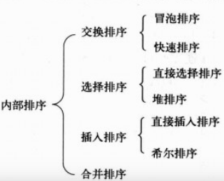

# 排序概述

在计算机中，由于数据的形式、数量和保存形式不同，对数据进行排序的方法也不同。按照排序过程中数据保存形式的不同，可将排序分为内部排序和外部排序两大类。

**1. 内部排序**

若整个排序过程不需要访问外部便能完成，则称此类排序问题为内部排序。内部排序的过程是一个逐步扩大记录的有序序列长度的过程。

内部排序又分为多种方法，可分为5类：插入排序、选择排序、交换排序和合并排序等。

**2. 外部排序**

使用内部排序时，所有待处理的数据都保存在计算机内存中。但是，计算机内存的容量是有限的，当对大批量的数据进行排序时，不能一次将数据全部装入内存，即待排序的记录存储在外存中。这时，可从外存读取部分数据到内存中，将内存中的数据排序后，再存储到外存中，然后再从外存读取部分数据，这样将待排序的数据在内存和外存之间进行多次数据交换，达到排序整个数据的目的，这就是外部排序。

外部排序最常用的算法是多路合并排序，即将原文件分解成多个能够一次性装入内存的部分，分别把每一部分调入内存堔成排序。然后，对已经排序的子文件进行合并排序。

