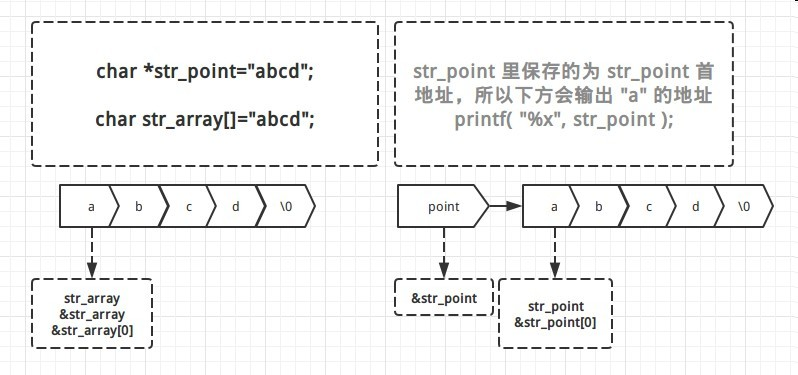

C_字符数组与字符串指针

##1. 字符数组为首地址,字符指针`变量`为指针

测试代码 :

	 char * str_point="abcd";
	 char str_array[]="abcd";

	 printf( "%x\n", str_point );
	 printf( "%x\n", &str_point );
	 printf( "%x\n", &str_point[0] );

	 printf( "%x\n", str_array );
	 printf( "%x\n", &str_array );
	 printf( "%x\n", &str_array[0] );

输出 :

	400b00
	8f47b3f8
	400b00
	8f47b3f0
	8f47b3f0
	8f47b3f0

str_array 保存的是字符串常量的首地址，而 str_array 本身地址和指向的地址是统一的;

str_point 保存的是字符串常量的地址，但 str_point 只是一个第三方的指针变量，str_point 地址与指向的地址并不相同。

具体如下图 :

##2. 字符指针的指向

字符指针，只能输出字符串，不能输出字符，除非前面加 *

测试代码 :

	char *str_point="abcd";
	printf( "%s", str_point );
	printf( "%c", str_point );
	printf( "%c", *str_point );
	printf( "%c", str_point[0] );

输出 :

	abcd
	X	//未知字符,不同的机子不同的时间的运行结果可能会不一样，因为地址可能会发生变化
	a
	a

##3. 字符串中的双引号

测试代码 :

	char *point,array='a';
	point = &array;
	point = "a";

**双引号做了三件事 :**

1. 申请了空间(在常量区)，存放了字符串
2. 在字符串尾加上了'/0'	
3. 返回地址

##4. 字符串与字符串常量

测试代码 :

	//我们可以这么写
	char *point = "abcd";
	char array[10] = "abcd";
	
	//但不可以如此使用
	char error_array[10];
	error_array = "1234";

**"abcd" 是常量么 ?**

1. 不是常量的情况 :

	"abcd" 作为字符数组初始值的时候不是常量, 如 :
	
		char str[] = "abcd";
		
	因为定义的一个字符数组, 所以就相当于定义一些空间来存放 "abcd", 而又因为字符数组就是把字符一个一个地存放的, 所以编辑器把这个语句解析为 :
	
		char str[4] = {'a', 'b', 'c', 'd'};
		
	根据之前标题3, 扩展最终结果应该是 :[^1]
	
[^1]: 双引号做了三件事
	
		char str[5] = {'a', 'b', 'c', 'd', '\0'};

	当初始化字符数组时，"abcd" 放在还不是常量，所以被放在栈上。

2. 是常量的情况 :

	"abcd" 赋值给一个字符指针亦是时, 如 :
	
		char *ptr = "abcd";
		
	因为定义的是一个普通字符指针, 并没有定义空间来存放 "abcd", 所以编辑器帮我们找个地方来放 "abcd", 显然, 把 "abcd" 当成常量并把它放到程序的常量区是编辑器最合适的选择。
	
	所以尽管 ptr 的类型不是 `const char *`, 但执行 `ptr[0] = 'a';` 也会发生异常, 因为这个语句试图去修改程序常量区中的东西。
	
	扩展一下，其写法类似如下 :
	
		const char *ptr = "abcd";
		//"abcd" 本身就可以做为 const char[4] 看待
		
	这里虽然 ptr 是一个普通的指针变量, 所以 ptr 是被放在栈上的, 只不过是它所指向的东西被放在常量区罢了。

>我们在调用赋值等式时，都是把常量赋给变量，(即 变量＝常量)。

扩展阅读 :

> 指针变量的值是地址，而数组(常量)的值虽然也是地址，但是却是一个常量，所以不能给常量赋值。"

## 5. 函数参数列表中的`字符数组`与`字符指针`

	对于函数参数列表中的以数组类型书写的形式参数，编译器把其解释为普通的指针类型, 如 :
	
		void func(char sa[100],int ia[20],char *p);
		//则sa的类型为char*，ia的类型为int*，p的类型为char*
 
## 6. 字符数组与字符指针的修改特性

测试代码 :

	char *point = "abcd";
	
字符串常量 "abcd" 出现在一个表达式中时, **"abcd" 表达式使用的值就是这些字符所存储的地址 (在常量区), 而不是这些字符本身**。

所以, 可以把字符串赋值给指向字符的指针 point, 而不能把字符串赋值给一个字符数组。

    //错误做法
    char array[10];
    array[10] = "abcd";
    或
    array = "abcd";
    
> 指针变量的值是地址，而数组(*常量*)的值虽然也是地址，但是却是一个常量，所以不能给常量赋值。

扩展阅读 :

> 在使用指针的时候, 指针可以自增, 而数组不能自增。

> 编译器给数组分配了空间, 数组 array 的地址也是一个常量了, 让常量自增肯定是不行的。

> 在指针自增的时候, 编译器会自动识别类型, 比如指针是指向 int 型的, 想获取下一个地址时, 指针直接 p++ 就行了。

> 注意事项 : 在 void 指针使用时, 不能使用指针运算, 因为 void 型编译器不能识别类型的长度 (即指针所指对象的体积), p++ 这样就是不合法的, 即不能进行数学运算, 也不能使用 `*`   取值操作, 想使用必需转换为其他类型。

## 7. 字符数组与字符指针的大小

测试代码 :

    char str_array[] = "abcd";
    char *str_point = "abcd";
    printf( "%d\n", sizeof(str_array) );  //5
    printf( "%d\n", sizeof(str_point) );  //4
    
`sizeof(str_array)` 字符数+1('`\0`'), 而 `sizeof(str_point)` 为 指针类型宽度, 也就是不管指针指向的值为多少, `sizeof(point)` 大小都为4。

http://www.cnblogs.com/KingOfFreedom/archive/2012/12/07/2807223.html

