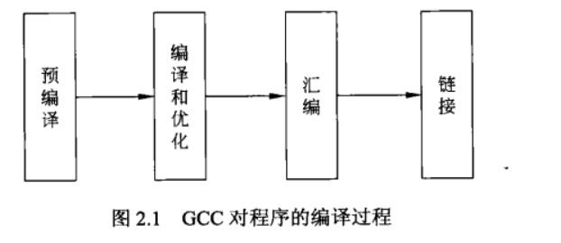

# GCC_默认文件扩展名含义

<!-- create time: 2016-06-03 16:28:15  -->

<!-- This file is created from $MARBOO_HOME/.media/starts/default.md
本文件由 $MARBOO_HOME/.media/starts/default.md 复制而来 -->

1. [GCC 默认扩展名策略](#name)
2. [GCC 编译器含义](#compile)
3. [GCC 默认加载头文件、库文件](#header)
4. [GCC 编译过程](#progress)

GCC 支持默认文件扩展名策略, 

**[文件扩展名含义](id:name)**  

文件扩展名 | GCC 所理解的含义
----|----
`*.c` | 该类文件为 C 语言的源文件
`*.h` | 该类文件为 C 语言的头文件
`*.i` | 该类文件为预处理后的 C 文件
`*.C` | 该类文件为 C++ 语言的源文件
`*.cc` | 该类文件为 C++ 语言的源文件
`*.cxx` | 该类文件为 C++ 语言的源文件
`*.m` | 该类文件为 Objective-C 语言的源文件
`*.s` | 该类文件为汇编语言的源文件
`*.o` | 该类文件为汇编后的目标文件
`*.a` | 该类文件为静态库
`*.so` | 该类文件为共享库
`a.out` | 该类文件为链接后的输出文件

GCC 下有很多的编译器, 可以支持 C 语言、C++ 语言等多种语言 : 

**[GCC 编译器含义](id:compile)**

GCC 编译器命令 | 含义
----|----
`cc` | 指的是 C 语言编译器
`cpp` | 指的是预处理编译器
`gcc` | 指的是 C 语言编译器
`g++` | 指的是 C++ 语言编译器

进行程序编译的时候, 头文件路径和库文件路径是编译器默认查找的地方 : 

**[默认路径](id:header)**

类型 | 存放路径
----|----
**头文件** | *按照先后顺序查找如下目录:* 
头文件1 | `/usr/local/include`  
头文件2 | `/usr/lib/gcc/i486-Linux-gnu/4.1.2/include`  
头文件3 | `/usr/include`
**库文件** | *按照先后顺序查找如下目录:* 
库文件1 | `/usr/lib/gcc/i486-Linux-gnu/4.1.2/`
库文件2 | `/usr/lib/gcc/i486-Linux-gnu/4.1.2/../../../../i486-Linux-gnu/lib/i486-Linux-gnu/4.1.2`
库文件3 | `/usr/lib/gcc/i486-Linux-gnu/4.1.2/../../../../i486-Linux-gnu/lib/`
库文件4 | `/usr/lib/gcc/i486-Linux-gnu/4.1.2/../../../../i486-Linux-gnu/4.1.2/`
库文件5 | `/usr/lib/gcc/i486-Linux-gnu/4.1.2/../../../../`
库文件6 | `/lib/i486-Linux-gnu/4.1.2/`
库文件7 | `/lib/`
库文件8 | `/usr/lib/i486-Linux-gnu/4.1.2/`
库文件9 | `/usr/lib/`

[**GCC 编译过程**](id:progress)

GCC 编译器对程序的编译, 分为 4 个阶段 : `预编译`、`编译和优化`、`汇编`和`链接`。GCC 的编译器可以将这 4 个步骤合并成一个。

