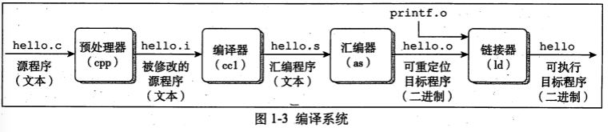

# 源文件_目标文件和可执行文件

<!-- create time: 2016-06-03 17:05:24  -->

<!-- This file is created from $MARBOO_HOME/.media/starts/default.md
本文件由 $MARBOO_HOME/.media/starts/default.md 复制而来 -->

**源文件**、**目标文件**和**可执行文件**是编译过程中经常用到的名词。

- **源文件** 通常指存放可编辑代码的文件, 如存放 C、C++ 和汇编语言的文件。

- **目标文件** 是指经过编译器的编译生成的 CPU 可识别的二进制代码, 但是**目标文件**一般不能执行, 因为其中的一些函数过程没有相关的指示和说明。

- **可执行文件** 就是**目标文件**与相关的**库链接后的文件**, 它是可以执行的。

### 编译过程

- **预编译过程** 预处理器(cpp)将程序中引用的头文件包含进源代码中, 并对一些宏进行替换, 通常是以 .i 作为文件扩展名。

- **编译过程** 编译器(ccl)将文件hello.i翻译成文件hello.s。将用户可识别的语言翻译成一组处理器可识别的操作码, 生成**目标文件**, 通常翻译成**汇编语言**, 而汇编语言通常和机器操作码之间是一种一对一的关系。

- **汇编阶段** 汇编器(as) 将hello.s 翻译成机器语言指令，把这些指令打包成一种叫做**可重写位目标程序**(relocatable object program)的格式,并将结果保存在目标文件 hello.o 中。hello.o 文件是一个二进制文件,它的字节编码是机器语言指令而不是字符。

- **链接阶段**  必须用某种方式组合起来才能运行, 这就是链接的作用。**目标文件** 中通常**仅解析了文件内部的变量和函数, 对于引用的函数和变量还没有解析, 这需要将其他已经编写好的目标文件引用进来将没有解析的变量和函数进行解析, 通常引用的是目标是库**。**链接完成后生成可执行的文件**。

具体过程如下图 : 


### GCC 命令使用

1.  编译程序生成**可执行文件** :
```bash
$ gcc -o test hello.c
$ . ./test
```
2. 生成**目标文件** :
```bash
$ gcc -c hello.c    //会生成一个名字为 hello.o 的文件
$ gcc -c -o test.o hello.c    //指定目标文件名为 test.o
```
3. 多文件编译 :
```bash
$ gcc -o test string.c main.c
```
4. **预处理**操作 :
```bash
$ gcc -E string.c
```
5. 编译成**汇编文件**
```bash
$ gcc -S string.c
```
