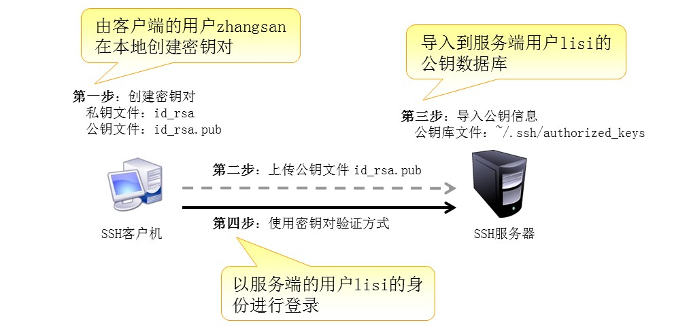

**SSH**：是一种安全通道协议，主要用来实现字符界面的远程登录，远程复制等功能(使用TCP的`22`号端口)。SSH协议对通信双方的数据传输进行了加密处理，其中包括用户登录时输入的用户口令。

在RHEL 5 系统中使用的是OpenSSH服务器由 `openssh` ，`openssh-server`  等软件包提供的(默认已经安装)， 并以将 `sshd` 添加为标准的系统服务。

SSH提供一下两种方式的登录验证：

1、**密码验证**：以服务器中本地系统用户的登录名称，密码进行验证。

2、**秘钥对验证**：要求提供相匹配的秘钥信息才能通过验证。通常先在客户机中创建一对秘钥文件(公钥和私钥)，然后将公钥文件放到服务器中的指定位置。

注意：当密码验证和私钥验证都启用时，服务器将优先使用秘钥验证。

#### SSH的配置文件：

sshd服务的配置文件默认在`/etc/ssh/sshd_config`，正确调整相关配置项，可以进一步提高sshd远程登录的安全性。

配置文件的内容可以分为以下三个部分：

1、常见SSH服务器监听的选项如下：

    Port 22                    //监听的端口为22
    Protocol 2                 //使用SSH V2协议
    ListenAdderss 0.0.0.0      //监听的地址为所有地址
    UseDNS no                  //禁止DNS反向解析

2、常见用户登录控制选项如下：

    PermitRootLogin no            //禁止root用户登录
    PermitEmptyPasswords no       //禁止空密码用户登录
    LoginGraceTime 2m             //登录验证时间为2分钟
    MaxAuthTries 6                //最大重试次数为6
    AllowUsers user               //只允许user用户登录，与DenyUsers选项相反

3、常见登录验证方式如下：

    PasswordAuthentication yes                  //启用密码验证
    PubkeyAuthentication yes                    //启用秘钥验证
    AuthorsizedKeysFile .ssh/authorized_keys    //指定公钥数据库文件


SSH客户端命令程序`ssh`、`scp`、`sftp`

#### SSH 命令

1. ssh 链接服务器

    ```
    $ ssh username@192.168.56.100
    ```
当用户第一次登录SSH服务器时， 必须接受服务器发来的RSA秘钥(根据输入yes)后才能继续。 接受的秘钥信息将保存到 “`~/.ssh/known_hosts`” 文件中。 如果默认端口被更改， 可以使用 `-p` 命令制定端口。

2. scp 命令服务器间文件传递
通过 `scp` 命令可以利用SSH安全连接与远程主机互相复制文件。 使用 `scp` 命令时， 除了必须制定复制源， 目标以外， 还应制定目标主机地址， 登录用户， 执行后提示验证口令等。 如下：

    **复制某文件到SSH服务器上**
    ```
    $ scp -r local_file username@192.168.56.100:remote_path_or_file
    ```
    **下载SSH服务器上的某个文件到本地**
    ```
    $ scp root@192.168.56.100:remote_file remote_path_or_file
    ```

3. sftp 目录管理
通过 `sftp` 命令可以利用SSH安全连接与远程主机上传， 下载文件， 采用了与 `FTP` 类似的登录过程和交互式环境， 便于目录资源管理。 如下：

    **使用sftp命令通过SSH安全连接登录远程服务器**
    ```
    $ sftp username@192.168.56.100
    ```

#### 构建密钥访问

下面我们来详细讲解如何构建秘钥对验证的SSH体系

如下图所示：简单描述了构建秘钥对验证的基本过程。



分四步来构建秘钥对验证的SSH : 

1. 在SSH客户机创建用户秘钥对。

    ```
    $ ssh-keygen -t rsa
    ```
    `-t`用于指定算法类型，`rsa` 表示使用 `rsa` 算法。
    秘钥短语用来对私钥文进行保护，当使用私钥验证登陆时必须提供此处所设置的短语。
    秘钥对默认保存在用户宿主目录下的 `.ssh/` 目录下。
2. 将公钥上传至SSH服务器
    将公钥上传至SSH服务器的方式有很多，可以使用U盘拷贝，也可以使用ftp、共享等方式上传。在此我们使用刚讲过的scp命令上传公钥文件。

3. 在SSH服务器中导入公钥文本
    在服务器中，目标用户(用来远程登录的用户)的公钥数据库位于 `~/.ssh/` 目录下，默认文件名是 `authorized_keys` 。 如下：将test的公钥文件导入到 user用户的公钥数据库中,追加到文件底部就可以。

4. 此时在客户端就可以使用秘钥对验证了。
    此时需要用户输入创建秘钥对时输入的秘钥短语，而不需要知道用户的密码即可登录SSH服务器。
    ```
    $ ssh username@192.168.56.100
    ```


