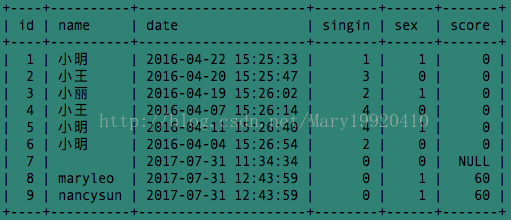
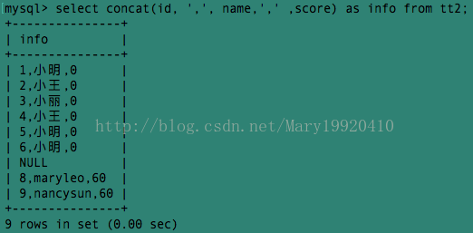
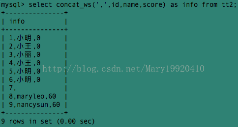
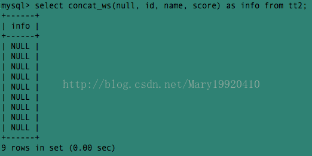
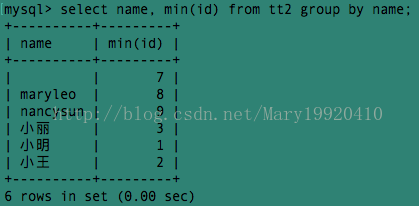
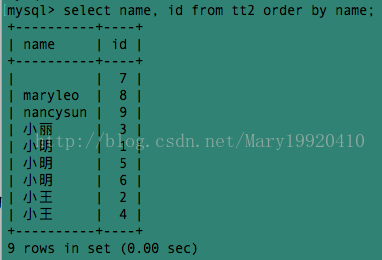
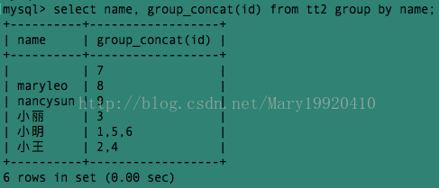
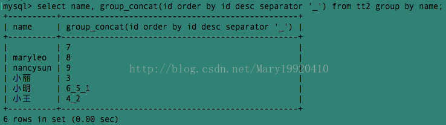
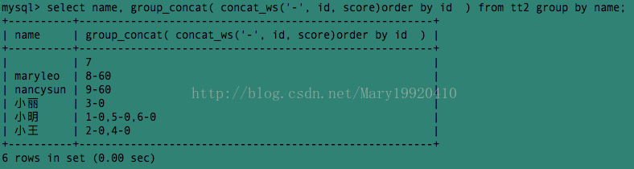

# concat以及group_concat的使用

以下表为例:

## 一、concat()函数

1、功能：将多个字符串连接成一个字符串。

2、语法：concat(str1, str2,...)

返回结果为连接参数产生的字符串，如果有任何一个参数为null，则返回值为null。

3、举例：

例1:select concat (id, name, score) as info from tt2;

中间有一行为null是因为tt2表中有一行的score值为null。

例2：在例1的结果中三个字段id，name，score的组合没有分隔符，我们可以加一个逗号作为分隔符：

这样看上去似乎顺眼了许多～～

但是输入sql语句麻烦了许多，三个字段需要输入两次逗号，如果10个字段，要输入九次逗号...麻烦死了啦，有没有什么简便方法呢？——于是可以指定参数之间的分隔符的concat_ws()来了！！！

## 二、concat_ws()函数

1、功能：和concat()一样，将多个字符串连接成一个字符串，但是可以一次性指定分隔符～（concat_ws就是concat with separator）

2、语法：concat_ws(separator, str1, str2, ...)

说明：第一个参数指定分隔符。需要注意的是分隔符不能为null，如果为null，则返回结果为null。

3、举例：

例3:我们使用concat_ws()将 分隔符指定为逗号，达到与例2相同的效果：

例4：把分隔符指定为null，结果全部变成了null：

## 三、group_concat()函数

前言：在有group by的查询语句中，select指定的字段要么就包含在group by语句的后面，作为分组的依据，要么就包含在聚合函数中。（有关group by的知识请戳：[浅析SQL中Group By的使用](http://blog.csdn.net/mary19920410/article/details/76398050)）。

例5：

该例查询了name相同的的人中最小的id。如果我们要查询name相同的人的所有的id呢？

当然我们可以这样查询：

例6：

但是这样同一个名字出现多次，看上去非常不直观。有没有更直观的方法，既让每个名字都只出现一次，又能够显示所有的名字相同的人的id呢？——使用group_concat()

1、功能：将group by产生的同一个分组中的值连接起来，返回一个字符串结果。

2、语法：group_concat( [distinct] 要连接的字段 [order by 排序字段 asc/desc  ] [separator '分隔符'] )

说明：通过使用distinct可以排除重复值；如果希望对结果中的值进行排序，可以使用order by子句；separator是一个字符串值，缺省为一个逗号。

3、举例：

例7：使用group_concat()和group by显示相同名字的人的id号：

例8：将上面的id号从大到小排序，且用'_'作为分隔符：

例9：上面的查询中显示了以name分组的每组中所有的id。接下来我们要查询以name分组的所有组的id和score：

来源：https://blog.csdn.net/mary19920410/article/details/76545053

