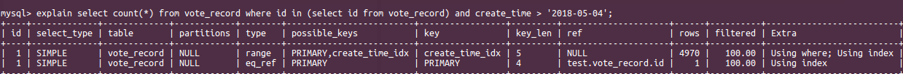

# MySQL SQL解析

mysql版本 : 
```mysql
mysql> status
--------------
mysql  Ver 14.14 Distrib 5.7.21, for Linux (x86_64) using  EditLine wrapper
```
 


## 字段解析

Column  | JSON Name | Meaning
----|----|---
id | select_id | 选择器标识符
select_type | None | 选择器类型
table | table_name | 输出数据的表
partitions | partitions | 匹配的分区
type | access_type | 链接类型
possible_keys | possible_keys | 可能使用的索引
key | key | 实际使用的索引
key_len | key_length | 所用索引的长度
ref | ref | 与索引相比的列(非惟一索引) 
rows | rows | 评估检测的数据行
filtered | filtered | 条件过滤行据点百分比(Percentage of rows filtered by table condition)
Extra | None | 附加信息

> **Note**
指标属性是NULL的时候在输出时便不会显示

> JSON properties which are NULL are not displayed in JSON-formatted EXPLAIN output.

- **id (JSON name: select_id)**

	选择器标识符。这是select语句的连续序号。如果行引用union行结果，值可以为NULL。这种情况下，表中列将显示如 <union M, N> 的方式，来表示行使用union 关联了 M 和 N。
	
	>The SELECT identifier. This is the sequential number of the SELECT within the query. The value can be NULL if the row refers to the union result of other rows. In this case, the table column shows a value like <unionM,N> to indicate that the row refers to the union of the rows with id values of M and N. 

- **select_type (JSON name: none)**

	选择类型，可以是如下表形式展示。用 JSON 格式展示 SELECT 语句执行为 query_block 类型，除非它是 SIMPLE 或者 PRIMARY。表中还显示了JSON名称（如果适用）
	
	> The type of SELECT, which can be any of those shown in the following table. A JSON-formatted EXPLAIN exposes the SELECT type as a property of a query_block, unless it is SIMPLE or PRIMARY. The JSON names (where applicable) are also shown in the table. 
	
	select_type Value | JSON Name | Meaning
	----|----|---
SIMPLE | None | 简单选择(未使用 UNION or 子句)
PRIMARY | None | 外部查询 *Outermost SELECT*
UNION | None | 二次或稍后的SELECT語句在UNION中*Second or later SELECT statement in a UNION*
DEPENDENT UNION | dependent (true)  | 二次或稍后的SELECT語句在UNION中依赖外部语句*Second or later SELECT statement in a UNION, dependent on outer query*
UNION RESULT  | union_result  | Union 结果集*Result of a UNION.*
SUBQUERY  | None  | 子查询中首个select*First SELECT in subquery*
DEPENDENT SUBQUERY  | dependent (true)  | 子查询中首个select,依赖外部查询*First SELECT in subquery, dependent on outer query*
DERIVED  | None  | 使用衍生表查询,从句中的子查询*Derived table SELECT (subquery in FROM clause)*
MATERIALIZED  | materialized_from_subquery  | 实例化子查询 Materialized subquery
UNCACHEABLE SUBQUERY  | cacheable (false)  | 外部查询中子查询生成不能被缓存且需要重新评估结果集的  A subquery for which the result cannot be cached and must be re-evaluated for each row of the outer query
UNCACHEABLE UNION  | cacheable (false)  | 不能缓存的子句使用Union二次或稍后的查询的 The second or later select in a UNION that belongs to an uncacheable subquery (see UNCACHEABLE SUBQUERY)

- **table (JSON name: table_name)**

	这行是显示表名称的，可能是以下形式的值：
	The name of the table to which the row of output refers. This can also be one of the following values:

	- `<union M,N>`: 此行表示联合M和N列 （The row refers to the union of the rows with id values of M and N.）

	- `<derived N>`: 此行表示行为N的衍生表结果，一个衍生表可能来自from子句   （The row refers to the derived table result for the row with an id value of N. A derived table may result, for example, from a subquery in the FROM clause.）

	- `<subquery N>`: 此行表示实例化列N子查询的结果   （The row refers to the result of a materialized subquery for the row with an id value of N.）
	
- **partitions (JSON name: partitions)**

	从查询匹配的记录中分区，值为NULL属于非分区表。
	
> The partitions from which records would be matched by the query. The value is NULL for nonpartitioned tables. 

- **type (JSON name: access_type)**

	关联类型.

- **possible_keys (JSON name: possible_keys)**
	possible_keys 表示 MySQL 可以用来查找的数据的索引。请注意，该列是完全独立于 EXPLAIN 显示中输出的表顺序的。这意味着一些在 possible_keys 中的键可能在实际中无法被用于生成表顺序。
	如果此列是 NULL (或者未定义的结构输出)，没有合适的索引。这种情况下，你可以通过检查 WHERE 从句是否引自一些字段或者合适的索引字段，来改进查询语句的性能。如果是这样，创建一个适当的索引，然后再用 EXPLAIN 检查下查询语句。
	
> The possible_keys column indicates the indexes from which MySQL can choose to find the rows in this table. Note that this column is totally independent of the order of the tables as displayed in the output from EXPLAIN. That means that some of the keys in possible_keys might not be usable in practice with the generated table order.
>
> If this column is NULL (or undefined in JSON-formatted output), there are no relevant indexes. In this case, you may be able to improve the performance of your query by examining the WHERE clause to check whether it refers to some column or columns that would be suitable for indexing. If so, create an appropriate index and check the query with EXPLAIN again. 

- **key (JSON name: key)**
key字段表示 MySQL实际使用的字段(索引)。如果 MySQL 决定使用 possible_keys 中某个索引检索数据，那这个索引就会列在这里。
可能这里显示的 key 并不是 possible_keys 中的值。如果 possible_keys 中没有适合检索数据的索引，这是可能发生的，但所有查询中搜索到的字段都是其他索引。也就是说，被指定的索引涵盖了被选择的字段，所以尽管它没用于确定检索哪些行，但索引扫描的数据比数据行扫描更有效。
对于 InnoDB,二级索引可以涵盖被 选择的字段，甚至假如查询也会搜索主键，因为 InnoDB 每个二级索引都存储着主键的值。如果 key 是 NULL， MySQL 找不到执行查询更有效的索引。
MySQL 中强制使用或忽略 possible_keys 中列，可以在查询中使用 FORCE INDEX，USE INDEX，IGNORE INDEX。
对于 MyISAM 表，运行 ANALYZE TABLE 有助于优化器选择更好的索引。在 MyISAM 表中， myisamchk --analyze 起相同的作用。

> The key column indicates the key (index) that MySQL actually decided to use. If MySQL decides to use one of the possible_keys indexes to look up rows, that index is listed as the key value.
>
> It is possible that key will name an index that is not present in the possible_keys value. This can happen if none of the possible_keys indexes are suitable for looking up rows, but all the columns selected by the query are columns of some other index. That is, the named index covers the selected columns, so although it is not used to determine which rows to retrieve, an index scan is more efficient than a data row scan.
>
> For InnoDB, a secondary index might cover the selected columns even if the query also selects the primary key because InnoDB stores the primary key value with each secondary index. If key is NULL, MySQL found no index to use for executing the query more efficiently. 
>
> To force MySQL to use or ignore an index listed in the possible_keys column, use FORCE INDEX, USE INDEX, or IGNORE INDEX in your query. See  [Section 8.9.4, “Index Hints”](https://dev.mysql.com/doc/refman/5.7/en/index-hints.html) .
>
>For MyISAM tables, running ANALYZE TABLE helps the optimizer choose better indexes. For MyISAM tables, myisamchk --analyze does the same. See [Section 13.7.2.1, “ANALYZE TABLE Syntax”](https://dev.mysql.com/doc/refman/5.7/en/analyze-table.html) , and [Section 7.6, “MyISAM Table Maintenance and Crash Recovery”](https://dev.mysql.com/doc/refman/5.7/en/myisam-table-maintenance.html) . 

- **key_len (JSON name: key_length)**
key_len 列表示 MySQL 决定使用 key 的长度。key_len 的值让你了解 MySQL 实际使用复合索引的长度。如果 key 比如是 NULL，那 key_len 也会显示为 NULL。
由于 key 的存储格式，这个 key 为 NULL 的列键长将比 NOT NULL 的列大。

>The key_len column indicates the length of the key that MySQL decided to use. The value of key_len enables you to determine how many parts of a multiple-part key MySQL actually uses. If the key column says NULL, the len_len column also says NULL.
>
>Due to the key storage format, the key length is one greater for a column that can be NULL than for a NOT NULL column. 

- **ref (JSON name: ref)**

 指出对 key 列所选择的索引的查找方式，常见的值有 const, func, NULL, 具体字段名。当 key 列为 NULL ，即不使用索引时，此值也相应的为 NULL 。

ref 字段表示查询数据时索引使用的哪些字段或者常量 。
如果值是 func,这可能是调用某些方法的结果。可以在 EXPLAIN 语句过后调用 SHOW WARNINGS( \W 或者 SHOW WARNINGS;) 在 EXPLAIN 扩展信息中查看方法名称。有可能这里指的方法仅仅是一个算数符号。

> The ref column shows which columns or constants are compared to the index named in the key column to select rows from the table.
>
> If the value is func, the value used is the result of some function. To see which function, use SHOW WARNINGS following EXPLAIN to see the extended EXPLAIN output. The function might actually be an operator such as an arithmetic operator. 

- **rows (JSON name: rows)**
这个字段表示 MySQL 执行查询必需检查的行数。
对于 InnoDB 表，这个值只是估算，或许不精确。

>The rows column indicates the number of rows MySQL believes it must examine to execute the query.
>
>For InnoDB tables, this number is an estimate, and may not always be exact.

- **filtered (JSON name: filtered)**
filtered 列表示预估查询条件检索的行数在表中所占百分比。这个字段表示存储引擎返回的数据在server层过滤后，剩下多少满足查询的记录数量的比例，注意是百分比，不是具体记录数。

>The filtered column indicates an estimated percentage of table rows that will be filtered by the table condition. That is, rows shows the estimated number of rows examined and rows × filtered / 100 shows the number of rows that will be joined with previous tables.

- **Extra (JSON name: none)**
这行包含 MySQL 解析查询的扩展信息。具体请看 EXPLAIN 展信息。


>This column contains additional information about how MySQL resolves the query. For descriptions of the different values, see EXPLAIN Extra Information.
>
>There is no single JSON property corresponding to the Extra column; however, values that can occur in this column are exposed as JSON properties, or as the text of the message property. 

#### 连接类型解释
这个字段类型是用来描述表是如何连接的。存取类型的值输出为JSON 格式，以下列表为连接类型及描述，排序从最优到最差。

- **system**
只有一行的表，这是常量连接中的特殊情况。

The table has only one row (= system table). This is a special case of the const join type.

- **const**
在起始查询中，表中只有最多一行数据匹配。因为只有一行，各列中的数据将被优化器当作常量来处理。常量表是非常快的，因为他们只读取一次。
当你将PRIMARY KEY 或 UNIQUE索引的所有部分与常量进行比较时会使用 const。在随后的查询中，tbl_name可以作为常量表。

The table has at most one matching row, which is read at the start of the query. Because there is only one row, values from the column in this row can be regarded as constants by the rest of the optimizer. const tables are very fast because they are read only once.
const is used when you compare all parts of a PRIMARY KEY or UNIQUE index to constant values. In the following queries, tbl_name can be used as a const table:
```sql
SELECT * FROM tbl_name WHERE primary_key=1;

SELECT * FROM tbl_name
      WHERE primary_key_part1=1 AND primary_key_part2=2;
```
- **eq_ref**
从这个表里读取一行，去之前表中一一连接。除 system 和 const 类型之外，这是最优的连接类型。当索引的所有部分用来链接且为PRIMARY KEY 或 UNIQUE NOT NULL索引时它会被用到。
eq_ref 可用于使用=运算符进行比较的索引列。进行比较的值可以是常量或者用之前读取的字段名的表达式。在随后例子中，MySQL会用eq_ref连接处理ref_table。

>One row is read from this table for each combination of rows from the previous tables. Other than the system and const types, this is the best possible join type. It is used when all parts of an index are used by the join and the index is a PRIMARY KEY or UNIQUE NOT NULL index.
>
>eq_ref can be used for indexed columns that are compared using the = operator. The comparison value can be a constant or an expression that uses columns from tables that are read before this table. In the following examples, MySQL can use an eq_ref join to process ref_table:
```sql
SELECT * FROM ref_table,other_table
	WHERE ref_table.key_column=other_table.column;

SELECT * FROM ref_table,other_table
	WHERE ref_table.key_column_part1=other_table.column
	AND ref_table.key_column_part2=1;
```
- **ref**
所有匹配索引的行逐一关联之前表中的行。如果连接使用了左主前缀主键或者如果这个索引是PRIMARY KEY 或 UNIQUE类型会使用ref。如果索引只匹配到了少量的行，这是不个不错的类型。
索引列用=或者<=>标识符，会用到ref。在随后例子中，MySQL将用 ref 链接来处理 ref_table。

>All rows with matching index values are read from this table for each combination of rows from the previous tables. ref is used if the join uses only a leftmost prefix of the key or if the key is not a PRIMARY KEY or UNIQUE index (in other words, if the join cannot select a single row based on the key value). If the key that is used matches only a few rows, this is a good join type.
>
>ref can be used for indexed columns that are compared using the = or <=> operator. In the following examples, MySQL can use a ref join to process ref_table:
```sql
SELECT * FROM ref_table WHERE key_column=expr;

SELECT * FROM ref_table,other_table
	WHERE ref_table.key_column=other_table.column;

SELECT * FROM ref_table,other_table
	WHERE ref_table.key_column_part1=other_table.column
	AND ref_table.key_column_part2=1;
```
- **fulltext**
这个链接表示全文索引。

> The join is performed using a FULLTEXT index.

- **ref_or_null**
这个连接类型类似ref, 但是 Mysql 附加了的额外搜索包含 NULL 值的行。这种连接类型主要用来优化子查询。在随后例子中，MySQL 将使用 ref_or_null 链接处理 ref_table。

>This join type is like ref, but with the addition that MySQL does an extra search for rows that contain NULL values. This join type optimization is used most often in resolving subqueries. In the following examples, MySQL can use a ref_or_null join to process ref_table:
```sql
SELECT * FROM ref_table
	WHERE key_column=expr OR key_column IS NULL;
```
See Section 8.2.1.12, [“IS NULL Optimization”](https://dev.mysql.com/doc/refman/5.7/en/is-null-optimization.html) .

- **index_merge**
这个链接类型表示优化器使用了索引合并。这种情况下在输出的行中包含了一系列使用到的索引列，并且key_len包含了一系列一系列的被用到索引最长的部分。

>This join type indicates that the Index Merge optimization is used. In this case, the key column in the output row contains a list of indexes used, and key_len contains a list of the longest key parts for the indexes used. For more information, see Section 8.2.1.3, [“Index Merge Optimization”](https://dev.mysql.com/doc/refman/5.7/en/index-merge-optimization.html) .

- **unique_subquery**
这种类型以 eq_ref 替换以下形式的一些 IN 子查询:
`value IN (SELECT primary_key FROM single_table WHERE some_expr)`
unique_subquery 只是一个更高效替换子查询的索引搜索方法。

>This type replaces eq_ref for some IN subqueries of the following form:
>
>value IN (SELECT primary_key FROM single_table WHERE some_expr)
>
>unique_subquery is just an index lookup function that replaces the subquery completely for better efficiency.

- **index_subquery**
这种链接类型类似于 unique_subquery。它替换 IN 子查询，但对下方子查询的非唯一索引也会生效。
`value IN (SELECT key_column FROM single_table WHERE some_expr)`

> This join type is similar to unique_subquery. It replaces IN subqueries, but it works for nonunique indexes in subqueries of the following form:
>
> value IN (SELECT key_column FROM single_table WHERE some_expr)

- **range**
只有在给定范围内的行才会被检索到，使用一个索引来选择行。被使用到索引的键列行数据将被输出。key_len 包含了使用的最长键内容。这种类型 ref 列是NULL。
当一个键列与一个常量比较，且使用了=，<>，>，>=，<，<=，IS NULL，<=>，BETWEEN，或者 IN()操作符时会使用 range。

> Only rows that are in a given range are retrieved, using an index to select the rows. The key column in the output row indicates which index is used. The key_len contains the longest key part that was used. The ref column is NULL for this type.
>
> range can be used when a key column is compared to a constant using any of the =, <>, >, >=, <, <=, IS NULL, <=>, BETWEEN, or IN() operators:
```sql
SELECT * FROM tbl_name
	WHERE key_column = 10;

SELECT * FROM tbl_name
	WHERE key_column BETWEEN 10 and 20;

SELECT * FROM tbl_name
	WHERE key_column IN (10,20,30);

SELECT * FROM tbl_name
	WHERE key_part1 = 10 AND key_part2 IN (10,20,30);
```
- **index**
这个连接类型类似 ALL，只是没有遍历索引树。以两种方式实现 :
	- 如果查询的索引是覆盖索引并且满足所有表数据要求，仅遍历索引树。这种情况下，Extra 列显示使用索引。一个仅有索引的列会比ALL更快，因为索引远远比表数据小的多。
	- 一个全表索引是指读取索并以索引顺序来查询数据。Extra 列未使用索引。

    MySQL 只会在查询单列索引时会用此连接类型。

> The index join type is the same as ALL, except that the index tree is scanned. This occurs two ways:
>
> - If the index is a covering index for the queries and can be used to satisfy all data required from the table, only the index tree is scanned. In this case, the Extra column says Using index. An index-only scan usually is faster than ALL because the size of the index usually is smaller than the table data.
>
> - A full table scan is performed using reads from the index to look up data rows in index order. Uses index does not appear in the Extra column. 
>
> MySQL can use this join type when the query uses only columns that are part of a single index.

- **ALL**
全文索引会遍历之前表中每一合并后的行。如果表格没有标记为常量的第一个表，这在其他情况下通常很糟，这样不好。通常，你可以通过增加有效的基于常量或者更早之前表数据的索引，避免 ALL 。

> A full table scan is done for each combination of rows from the previous tables. This is normally not good if the table is the first table not marked const, and usually very bad in all other cases. Normally, you can avoid ALL by adding indexes that enable row retrieval from the table based on constant values or column values from earlier tables. 

#### Explain 额外信息
Extra 列展示的是 MySQL 解析查询语句的相关附加信息。下面列表将介绍值与对应的含意。其中一些有特殊意义，另一些只是文本介绍。
如果想让你查询尽可能快，找出 Extra 列包含 Using filesort 和 Using temporary。

- **Distinct (JSON property: distinct) **
MySQL 检索唯一值，如果找到第一个匹配项，就不会继续往下搜索多余的数据。

> MySQL is looking for distinct values, so it stops searching for more rows for the current row combination after it has found the first matching row. 

- **FirstMatch(tbl_name) (JSON property: first_match) **
tbl_name 使用 FirstMatch 半连接连接快捷策略。

> The semi-join FirstMatch join shortcutting strategy is used for tbl_name. 

- **Full scan on NULL key (JSON property: message) **
当优化器不能使用索引访问方法时，会发生子查询优化作为回调策略。

>This occurs for subquery optimization as a fallback strategy when the optimizer cannot use an index-lookup access method. 

- **Impossible HAVING (JSON property: message) **
HAVING 子句异常，并不能找到任何结果。

>  The HAVING clause is always false and cannot select any rows.

- **Impossible WHERE (JSON property: message)**
WHERE 子句异常，并不能找到任何结果。

>The WHERE clause is always false and cannot select any rows.

- **Impossible WHERE noticed after reading const tables (JSON property: message)**
MySQL 读取所有 const (和system) 表并且提示 WHERE 子句异常。

> MySQL has read all const (and system) tables and notice that the WHERE clause is always false.

- **LooseScan(m..n) (JSON property: message)**
使用半链接 LooseScan 策略，m 和 n 是关键部分编号。

> The semi-join LooseScan strategy is used. m and n are key part numbers.

- **No matching min/max row (JSON property: message)**
查询语句未查询到匹配数据，比如 `SELECT MIN(...) FROM ... WHERE condition`

>No row satisfies the condition for a query such as SELECT MIN(...) FROM ... WHERE condition.

- **no matching row in const table (JSON property: message)**
对于链接查询，存在一个空表或没有满足唯一索引条件的表。

> For a query with a join, there was an empty table or a table with no rows satisfying a unique index condition.

- **No matching rows after partition pruning (JSON property: message)**
对于 DELETE 或 UPDATE，优化器在分区修剪后发现没有数可以用来删除或修改的数据。类似 SELECT 语句中 WHERE 不可用。

> For DELETE or UPDATE, the optimizer found nothing to delete or update after partition pruning. It is similar in meaning to Impossible WHERE for SELECT statements.

- **No tables used (JSON property: message)**
查询中没有 FROM 从句，或者有一个 FROM DUAL 从句。
对于插入或替换声明，当没有 SELECT 的部分时，EXPLAIN 返回这个值。例如， `EXPLAIN INSERT INTO t VALUES(10)`, 因为这相当于 `EXPLAIN INSERT INTO t SELECT 10 FROM DUAL`.

>The query has no FROM clause, or has a FROM DUAL clause.
>
>For INSERT or REPLACE statements, EXPLAIN displays this value when there is no SELECT part. For example, it appears for EXPLAIN INSERT INTO t VALUES(10) because that is equivalent to EXPLAIN INSERT INTO t SELECT 10 FROM DUAL. 

 - **Not exists (JSON property: message)**

> MySQL was able to do a LEFT JOIN optimization on the query and does not examine more rows in this table for the previous row combination after it finds one row that matches the LEFT JOIN criteria. Here is an example of the type of query that can be optimized this way:
```sql
SELECT * FROM t1 LEFT JOIN t2 ON t1.id=t2.id
	WHERE t2.id IS NULL;
```

> Assume that t2.id is defined as NOT NULL. In this case, MySQL scans t1 and looks up the rows in t2 using the values of t1.id. If MySQL finds a matching row in t2, it knows that t2.id can never be NULL, and does not scan through the rest of the rows in t2 that have the same id value. In other words, for each row in t1, MySQL needs to do only a single lookup in t2, regardless of how many rows actually match in t2.

- **Plan isn't ready yet (JSON property: none)**

> This value occurs with EXPLAIN FOR CONNECTION when the optimizer has not finished creating the execution plan for the statement executing in the named connection. If execution plan output comprises multiple lines, any or all of them could have this Extra value, depending on the progress of the optimizer in determining the full execution plan.

- **Range checked for each record (index map: N) (JSON property: message)**

> MySQL found no good index to use, but found that some of indexes might be used after column values from preceding tables are known. For each row combination in the preceding tables, MySQL checks whether it is possible to use a range or index_merge access method to retrieve rows. This is not very fast, but is faster than performing a join with no index at all. The applicability criteria are as described in [Section 8.2.1.2, “Range Optimization”](https://dev.mysql.com/doc/refman/5.7/en/range-optimization.html) , and [Section 8.2.1.3, “Index Merge Optimization”](https://dev.mysql.com/doc/refman/5.7/en/index-merge-optimization.html) , with the exception that all column values for the preceding table are known and considered to be constants.
>
> Indexes are numbered beginning with 1, in the same order as shown by SHOW INDEX for the table. The index map value N is a bitm ask value that indicates which indexes are candidates. For example, a value of 0x19 (binary 11001) means that indexes 1, 4, and 5 will be considered.

- **Scanned N databases (JSON property: message)**

> This indicates how many directory scans the server performs when processing a query for INFORMATION_SCHEMA tables, as described in [Section 8.2.3, “Optimizing INFORMATION_SCHEMA Queries”](https://dev.mysql.com/doc/refman/5.7/en/information-schema-optimization.html) . The value of N can be 0, 1, or all.

- **Select tables optimized away (JSON property: message)**

> The optimizer determined 1) that at most one row should be returned, and 2) that to produce this row, a deterministic set of rows must be read. When the rows to be read can be read during the optimization phase (for example, by reading index rows), there is no need to read any tables during query execution.
>
>The first condition is fulfilled when the query is implicitly grouped (contains an aggregate function but no GROUP BY clause). The second condition is fulfilled when one row lookup is performed per index used. The number of indexes read determines the number of rows to read.
>
>Consider the following implicitly grouped query:
```sql
SELECT MIN(c1), MIN(c2) FROM t1;
```
>Suppose that MIN(c1) can be retrieved by reading one index row and MIN(c2) can be retrieved by reading one row from a different index. That is, for each column c1 and c2, there exists an index where the column is the first column of the index. In this case, one row is returned, produced by reading two deterministic rows.
>
>This Extra value does not occur if the rows to read are not deterministic. Consider this query:
```sql
SELECT MIN(c2) FROM t1 WHERE c1 <= 10;
```
>Suppose that (c1, c2) is a covering index. Using this index, all rows with c1 <= 10 must be scanned to find the minimum c2 value. By contrast, consider this query:
```sql
SELECT MIN(c2) FROM t1 WHERE c1 = 10;
```
>In this case, the first index row with c1 = 10 contains the minimum c2 value. Only one row must be read to produce the returned row.
>
>For storage engines that maintain an exact row count per table (such as MyISAM, but not InnoDB), this Extra value can occur for COUNT(*) queries for which the WHERE clause is missing or always true and there is no GROUP BY clause. (This is an instance of an implicitly grouped query where the storage engine influences whether a deterministic number of rows can be read.)

- **Skip_open_table, Open_frm_only, Open_full_table (JSON property: message)**

>These values indicate file-opening optimizations that apply to queries for INFORMATION_SCHEMA tables, as described in [Section 8.2.3, “Optimizing INFORMATION_SCHEMA Queries”](https://dev.mysql.com/doc/refman/5.7/en/information-schema-optimization.html) .

> - Skip_open_table: Table files do not need to be opened. The information has already become available within the query by scanning the database directory.
> - Open_frm_only: Only the table's .frm file need be opened.
> - Open_full_table: The unoptimized information lookup. The .frm, .MYD, and .MYI files must be opened. 

- **Start temporary, End temporary (JSON property: message)**

> This indicates temporary table use for the semi-join Duplicate Weedout strategy.

- **unique row not found (JSON property: message)**

> For a query such as SELECT ... FROM tbl_name, no rows satisfy the condition for a UNIQUE index or PRIMARY KEY on the table.

- **Using filesort (JSON property: using_filesort)**
MySQL 用另外通道来对结果进行排序。排序是按照连接类型遍历所有行，并为与 WHERE 子句匹配的所有行存储排序键和指向行的指针。

> MySQL must do an extra pass to find out how to retrieve the rows in sorted order. The sort is done by going through all rows according to the join type and storing the sort key and pointer to the row for all rows that match the WHERE clause. The keys then are sorted and the rows are retrieved in sorted order. See [Section 8.2.1.13, “ORDER BY Optimization”](https://dev.mysql.com/doc/refman/5.7/en/order-by-optimization.html) .

- **Using index (JSON property: using_index)**

> The column information is retrieved from the table using only information in the index tree without having to do an additional seek to read the actual row. This strategy can be used when the query uses only columns that are part of a single index.
>
> For InnoDB tables that have a user-defined clustered index, that index can be used even when Using index is absent from the Extra column. This is the case if type is index and key is PRIMARY.

- **Using index condition (JSON property: using_index_condition)**
通过访问元组来读取表，并首先测试它们来决定是否读取全表。这样，除非必要，否则索引信息将用于推迟读取全表行。

> Tables are read by accessing index tuples and testing them first to determine whether to read full table rows. In this way, index information is used to defer (“push down”) reading full table rows unless it is necessary. See Section 8.2.1.5, [“Index Condition Pushdown Optimization”](https://dev.mysql.com/doc/refman/5.7/en/index-condition-pushdown-optimization.html) .

- **Using index for group-by (JSON property: using_index_for_group_by)**

> Similar to the Using index table access method, Using index for group-by indicates that MySQL found an index that can be used to retrieve all columns of a GROUP BY or DISTINCT query without any extra disk access to the actual table. Additionally, the index is used in the most efficient way so that for each group, only a few index entries are read. For details, see [Section 8.2.1.14, “GROUP BY Optimization”](https://dev.mysql.com/doc/refman/5.7/en/group-by-optimization.html) .

- **Using join buffer (Block Nested Loop), Using join buffer (Batched Key Access) (JSON property: using_join_buffer)**

> Tables from earlier joins are read in portions into the join buffer, and then their rows are used from the buffer to perform the join with the current table. (Block Nested Loop) indicates use of the Block Nested-Loop algorithm and (Batched Key Access) indicates use of the Batched Key Access algorithm. That is, the keys from the table on the preceding line of the EXPLAIN output will be buffered, and the matching rows will be fetched in batches from the table represented by the line in which Using join buffer appears.
>
> In JSON-formatted output, the value of using_join_buffer is always either one of Block Nested Loop or Batched Key Access.

- **Using MRR (JSON property: message)**

> Tables are read using the Multi-Range Read optimization strategy. See [Section 8.2.1.10, “Multi-Range Read Optimization”](https://dev.mysql.com/doc/refman/5.7/en/mrr-optimization.html) .

- **Using sort_union(...), Using union(...), Using intersect(...) (JSON property: message)**

> These indicate the particular algorithm showing how index scans are merged for the index_merge join type. See [Section 8.2.1.3, “Index Merge Optimization”](https://dev.mysql.com/doc/refman/5.7/en/index-merge-optimization.html) .

- **Using temporary (JSON property: using_temporary_table)**
在解析查询时，MySQL 需要创建一个临时表来保存结果。如果语句中包含不同方式列出的 GROUP BY 和 ORDER BY 从句时比较常见。
> To resolve the query, MySQL needs to create a temporary table to hold the result. This typically happens if the query contains GROUP BY and ORDER BY clauses that list columns differently.

- **Using where (JSON property: attached_condition)**
WHERE 从句用来限制哪些行要匹配下一个表或者发送到客户端。除非你专门想获取或者检测所有表中数据行，否则如果 Extra 值不是使用 where 和表链接类型为 ALL 或 index 的，则查询中可能有问题。
使用 where 没有直接对应的 JSON 格式输出;attached_condition属性包括使用的任何 WHERE 条件。
> A WHERE clause is used to restrict which rows to match against the next table or send to the client. Unless you specifically intend to fetch or examine all rows from the table, you may have something wrong in your query if the Extra value is not Using where and the table join type is ALL or index.
>
> Using where has no direct counterpart in JSON-formatted output; the attached_condition property contains any WHERE condition used.

- **Using where with pushed condition (JSON property: message)**

> This item applies to NDB tables only. It means that NDB Cluster is using the Condition Pushdown optimization to improve the efficiency of a direct comparison between a nonindexed column and a constant. In such cases, the condition is “pushed down” to the cluster's data nodes and is evaluated on all data nodes simultaneously. This eliminates the need to send nonmatching rows over the network, and can speed up such queries by a factor of 5 to 10 times over cases where Condition Pushdown could be but is not used. For more information, see [ Section 8.2.1.4, “Engine Condition Pushdown Optimization”](https://dev.mysql.com/doc/refman/5.7/en/condition-pushdown-optimization.html) .

- **Zero limit (JSON property: message)**
查询被设置了 LIMIT 0 从句，没有搜索到结果。
> The query had a LIMIT 0 clause and cannot select any rows. 


