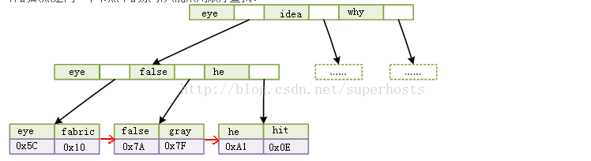

# MySQL_引擎索引及BTree

<!-- create time: 2016-05-03 17:34:52  -->

<!-- This file is created from $MARBOO_HOME/.media/starts/default.md
本文件由 $MARBOO_HOME/.media/starts/default.md 复制而来 -->

## 索引类型(聚簇索引和非聚簇索引)

**聚簇索引** : 索引的顺序就是数据存放的顺序，所以，很容易理解，一张数据表只能有一个聚簇索引。
聚簇索引要比非聚簇索引查询效率高很多，特别是范围查询的时候。所以，至于聚簇索引到底应该为主键，还是其他字段，这个可以再讨论。

> 应用 : InnoDB引擎

**非聚簇索引** : 叶级页指向表中的记录，记录的物理顺序与逻辑顺序没有必然的联系。非聚簇索引则更像书的名词索引表，索引表中的顺序通常与实际的页码顺序是不一致的。

> 应用 : MyISAM引擎

### 聚簇索引与非聚簇索引的区别

**聚簇索引**的`叶节点`就是`数据节点`，而**非聚簇索引**的`叶节点`仍然是`索引节点`，并保留一个链接指向对应`数据块`。

**聚簇索引**主键的插入速度要比**非聚簇索引**主键的插入速度慢很多。

相比之下，**聚簇索引**适合`排序`，**非聚簇索引**不适合用在排序的场合。因为**聚簇索引**本身已经是按照物理顺序放置的，排序很快。**非聚簇索引**则没有按序存放，需要额外消耗资源来排序。

当你需要取出一定范围内的数据时，用**聚簇索引**也比用**非聚簇索引**好。

## MySQL 索引

mysql中，不同的存储引擎对索引的实现方式不同，大致说下MyISAM和InnoDB两种存储引擎。

### 1. MySQL 索引
**MyISAM**的`B+Tree`的叶子节点上的data，并不是数据本身，而是数据存放的地址。主索引和辅助索引没啥区别，只是主索引中的key一定得是唯一的。这里的索引都是非聚簇索引。

**MyISAM**还采用压缩机制存储索引，比如，第一个索引为“her”，第二个索引为“here”，那么第二个索引会被存储为“3,e”，这样的缺点是同一个节点中的索引只能采用顺序查找。

**InnoDB**的数据文件本身就是索引文件，`B+Tree`的叶子节点上的data就是数据本身，key为主键，这是聚簇索引。非聚簇索引，叶子节点上的data是主键(所以聚簇索引的key，不能过长)。为什么存放的主键，而不是记录所在地址呢，理由相当简单，因为记录所在地址并不能保证一定不会变，但主键可以保证。

### 2. 聚簇索引

**聚簇索引**不但在检索上可以大大滴提高效率，在数据读取上也一样。比如：需要查询f~t的所有单词。

一个使用**MyISAM**的主索引，一个使用**InnoDB**的聚簇索引。两种索引的`B+Tree`检索时间一样，但读取时却有了差异。

因为**MyISAM**的主索引为`非聚簇索引`，那么他的数据的物理地址必然是凌乱的，拿到这些物理地址，按照合适的算法进行I/O读取，于是开始不停的寻道不停的旋转。**聚簇索引**则只需一次I/O。

不过，如果涉及到大数据量的`排序`、`全表扫描`、`count`之类的操作的话，还是**MyISAM**占优势些，因为索引所占空间小，这些操作是需要在内存中完成的。

鉴于`聚簇索引`的范围查询效率，很多人认为使用主键作为**聚簇索引**太多浪费，毕竟几乎不会使用主键进行范围查询。但若再考虑到**聚簇索引**的存储，就不好定论了。

## BTree

索引，是为了更快的查询数据，查询算法有很多，对应的数据结构也不少，数据库常用的索引数据结构一般为`B+Tree`。

### 1. B-Tree(即BTree)

**B-tree**（多路搜索树，并不是二叉的）是一种常见的数据结构。使用**B-tree**结构可以显著减少定位记录时所经历的中间过程，从而加快存取速度。

关于**B-Tree**的官方定义个人觉得比较难懂，通俗一点就是举个例子。假如：一本英文字典，单词+详细解释组成了一条记录，现在需要索引单词，那么以单词为key，单词+详细解释为data，**B-Tree**就是以一个二元组{key,data}来定义一条记录。如果一个节点有3条记录，那么会有对应的4个指针，用以指向下一个节点。**B-Tree**是有序且平衡的，所有叶子节点在同一层，即不会出现某个分支层级多，某个分支层级少的情况。

因为**B-Tree**是有序的，所以它的查找就简单了，先从根节点开始二分查找，找到则返回节点；否则沿着区间指针查找下一个节点。比如，查询false这个单词。

### 2. B+Tree(即B+Tree)

与**B-Tree**不同的是，**B+Tree**每个节点只有key，没有data；而且`叶子节点`没有指针。也就是说**B+Tree**的`叶子节点`和`内节点`的数据结构是不一样的。  

一般数据库采用的是**B+Tree**，而且经过了一些优化，比如在叶子节点上增加了顺序访问指针，提高区间查询效率。
>比如：查询首字母为f~t的所有单词。那么只需查到f开头的第一个单词fabric，然后沿着叶子节点的开始遍历，直到找到最后一个以t开头的单词为止。

简单介绍了**B-/+Tree**，至于众多数据结构中，为何数据库索引选择**BTree**，而且选择**B+Tree**，下面从计算机存储原理方面简单说说。

### 3、读内存和读磁盘

内存读取和磁盘读取的效率是相差很大的。

简单点说说内存读取，内存是由一系列的存储单元组成的，每个`存储单元`存储固定大小的数据，且有一个唯一地址。

当需要读内存时，将`地址信号`放到`地址总线`上传给内存，内存解析信号并定位到存储单元，然后把该存储单元上的数据放到`数据总线`上，回传。

写内存时，系统将要写入的数据和`单元地址`分别放到`数据总线`和`地址总线`上，内存读取两个总线的内容，做相应的写操作。

内存存取效率，跟次数有关，先读取A数据还是后读取A数据不会影响存取效率。而磁盘存取就不一样了，磁盘I/O涉及机械操作。

磁盘是由大小相同且同轴的圆形盘片组成，磁盘可以转动(各个磁盘须同时转动)。磁盘的一侧有磁头支架，磁头支架固定了一组磁头，每个磁头负责存取一个磁盘的内容。磁头不动，磁盘转动，但磁臂可以前后动，用于读取不同磁道上的数据。磁道就是以盘片为中心划分出来的一系列同心环(如图标红那圈)。磁道又划分为一个个小段，叫`扇区`，是磁盘的最小存储单元。

磁盘读取时，系统将数据`逻辑地址`传给磁盘，磁盘的控制电路会解析出`物理地址`，即哪个磁道哪个扇区。于是磁头需要前后移动到对应的磁道，消耗的时间叫`寻道时间`，然后磁盘旋转将对应的扇区转到磁头下，消耗的时间叫`旋转时间`。所以，适当的操作顺序和数据存放可以减少`寻道时间`和`旋转时间`。

为了尽量减少I/O操作，磁盘读取每次都会预读，大小通常为页的整数倍。即使只需要读取一个字节，磁盘也会读取一页的数据(通常为4K)放入内存，内存与磁盘以页为单位交换数据。因为局部性原理认为，通常一个数据被用到，其附近的数据也会立马被用到。

### 4、检索性能分析

**B-Tree**：如果一次检索需要访问4个节点，数据库系统设计者利用磁盘预读原理，把`节点`的大小设计为一个页，那读取一个`节点`只需要一次I/O操作，完成这次检索操作，最多需要3次I/O(根节点常驻内存)。数据记录越小，每个`节点`存放的数据就越多，树的高度也就越小，I/O操作就少了，检索效率也就上去了。

**B+Tree**：`内节点`只存key，大大滴减少了`内节点`的大小，那么每个`节点`就可以存放更多的记录，树的更矮了，I/O操作更少了。所以**B+Tree**拥有更好的性能。

### 5、其他索引方式

**散列索引**：通过`HASH`来定位的一种索引，这种索引用的较少，通过用于单值查询。`InnoDB`的自适应索引就是`HASH`索引。

**位图索引**：字段值固定且少，比如性别、状态。在同时对多个这样的字段and/or查询时，效率极高，直接按位与/或就可以得到结果了。所以，应用范围局限。
