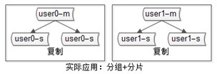
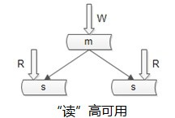
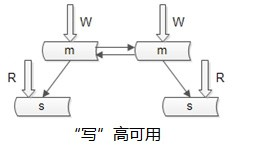
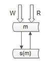
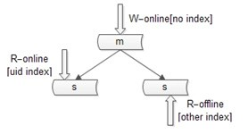
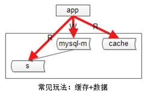
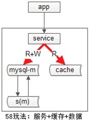
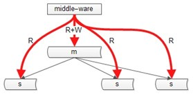
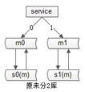
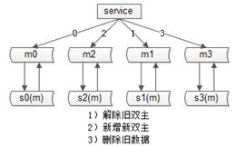

# Mysql_大数据主从

<!-- create time: 2016-03-24 16:24:03  -->

<!-- This file is created from $MARBOO_HOME/.media/starts/default.md
本文件由 $MARBOO_HOME/.media/starts/default.md 复制而来 -->

### 概念三“分组”

    分组解决“可用性”问题，分组通常通过主从复制的方式实现。

互联网公司数据库实际软件架构是：又分片，又分组（如下图）

4.4.2 设计思路

数据库软件架构师平时设计些什么东西呢？至少要考虑以下四点：

    如何保证数据可用性；
    如何提高数据库读性能（大部分应用读多写少，读会先成为瓶颈）；
    如何保证一致性；
    如何提高扩展性；

#### 1. 如何保证数据的可用性？

解决可用性问题的思路是=>冗余如何保证站点的可用性？复制站点，冗余站点如何保证服务的可用性？复制服务，冗余服务如何保证数据的可用性？复制数据，冗余数据数据的冗余，会带来一个副作用=>引发一致性问题（先不说一致性问题，先说可用性）。

#### 2. 如何保证数据库“读”高可用？ 

冗余读库冗余读库带来的副作用？读写有延时，可能不一致上面这个图是很多互联网公司mysql的架构，写仍然是单点，不能保证写高可用。  

#### 3. 如何保证数据库“写”高可用？

冗余写库采用双主互备的方式，可以冗余写库带来的副作用？双写同步，数据可能冲突（例如“自增id”同步冲突）,如何解决同步冲突，有两种常见解决方案：

    1. 两个写库使用不同的初始值，相同的步长来增加id：1写库的id为0,2,4,6…；2写库的id为1,3,5,7…；
    
    2. 不使用数据的id，业务层自己生成唯一的id，保证数据不冲突；

实际中没有使用上述两种架构来做读写的“高可用”，采用的是“双主当主从用”的方式：

仍是双主，但只有一个主提供服务（读+写），另一个主是“shadow-master”，只用来保证高可用，平时不提供服务。 master挂了，shadow-master顶上（vip漂移，对业务层透明，不需要人工介入）。这种方式的好处：

    1. 读写没有延时；
    2. 读写高可用；

不足：

    1. 不能通过加从库的方式扩展读性能；
    2. 资源利用率为50%，一台冗余主没有提供服务；

那如何提高读性能呢？进入第二个话题，如何提供读性能。

#### 4. 如何扩展读性能

提高读性能的方式大致有三种:

1. 是建立索引。这种方式不展开，要提到的一点是，不同的库可以建立不同的索引。写库不建立索引；线上读库建立线上访问索引，例如uid；线下读库建立线下访问索引，例如time；

    

2. 扩充读性能的方式是，增加从库，这种方法大家用的比较多，但是，存在两个缺点：

        1. 从库越多，同步越慢；
        2. 同步越慢，数据不一致窗口越大（不一致后面说，还是先说读性能的提高）；

    实际中没有采用这种方法提高数据库读性能（没有从库），采用的是增加缓存。常见的缓存架构如下：
    **上游是业务应用，下游是主库，从库（读写分离），缓存。**
    
    

    实际的玩法：**服务+数据库+缓存一套**  
    业务层不直接面向db和cache，服务层屏蔽了底层db、cache的复杂性。为什么要引入服务层，今天不展开，采用了“服务+数据库+缓存一套”的方式提供数据访问，用cache提高读性能。  
    
    

    不管采用主从的方式扩展读性能，还是缓存的方式扩展读性能，数据都要复制多份（主+从，db+cache），一定会引发一致性问题。

#### 5. 如何保证一致性？
主从数据库的一致性，通常有两种解决方案：

1. **中间件**   
如果某一个key有写操作，在不一致时间窗口内，中间件会将这个key的读操作也路由到主库上。这个方案的缺点是，数据库中间件的门槛较高（百度，腾讯，阿里，360等一些公司有）。

    

2. **强制读主**  
    实际用的“双主当主从用”的架构，不存在主从不一致的问题。

    

第二类不一致，是db与缓存间的不一致：

常见的缓存架构如上，此时写操作的顺序是：

    （1）淘汰cache；
    （2）写数据库；

读操作的顺序是：

    （1）读cache，如果cache hit则返回；
    （2）如果cache miss，则读从库；
    （3）读从库后，将数据放回cache；

在一些异常时序情况下，有可能从【从库读到旧数据（同步还没有完成），旧数据入cache后】，数据会长期不一致。解决办法是“缓存双淘汰”，写操作时序升级为：

    （1）淘汰cache；
    （2）写数据库；
    （3）在经验“主从同步延时窗口时间”后，再次发起一个异步淘汰cache的请求；

这样，即使有脏数据如cache，一个小的时间窗口之后，脏数据还是会被淘汰。带来的代价是，多引入一次读miss（成本可以忽略）。

除此之外，最佳实践之一是：建议为所有cache中的item设置一个超时时间。

#### 6. 如何提高数据库的扩展性？
    
原来用hash的方式路由，分为2个库，数据量还是太大，要分为3个库，势必需要进行数据迁移，有一个很帅气的“数据库秒级扩容”方案。如何秒级扩容？首先，我们不做2库变3库的扩容，我们做2库变4库（库加倍）的扩容（未来4->8->16）
    

服务+数据库是一套（省去了缓存），数据库采用“双主”的模式。

**扩容步骤**：

    第一步，将一个主库提升;
    
    第二步，修改配置，
        2库变4库（原来MOD2，现在配置修改后MOD4），扩容完成；
        原MOD2为偶的部分，现在会MOD4余0或者2；原MOD2为奇的部分，现在会MOD4余1或者3；数据不需要迁移，同时，双主互相同步，一遍是余0，一边余2，两边数据同步也不会冲突，秒级完成扩容！
    
    最后，要做一些收尾工作：
        将旧的双主同步解除；       
        增加新的双主（双主是保证可用性的，shadow-master平时不提供）    ；      
        删除多余的数据（余0的主，可以将余2删除掉）；  `

这样，秒级别内，我们就完成了2库变4库的扩展。
