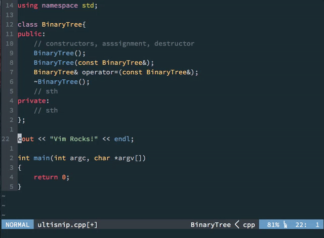

# vim_UltiSnips 代码片段

### 安装 vim 插件
```vim
Plugin 'SirVer/ultisnips' 
Plugin "honza/vim-snippets"
```

要使用 UltiSnips，vim 需要开启对 python 的支持。插件配置 :
```vim
" SirVer/ultisnips {
" Trigger configuration. Do not use <tab> if you use https://github.com/Valloric/YouCompleteMe.
" let g:UltiSnipsExpandTrigger="<tab>"
" 这里我把显示快捷键与向前跳转都换成了 Ctrl-L
    let g:UltiSnipsExpandTrigger="<C-l>"
    let g:UltiSnipsJumpForwardTrigger="<C-l>"
    let g:UltiSnipsJumpBackwardTrigger="<C-z>"
" }
```

### UltiSnips 代码片段
UltiSnips 会自动抓取最新的修改，所以我们不用重启 vim，只要保存了 snippet 文件，就可以直接使用。代码片段文件所在的目录一般放在 UltiSnips 插件目录中 **bundle/vim-snippets/UltiSnips/**。简单来说，定义的一段 snip 的格式是这样的：
```vim
snippet 关键词 “说明” 设定
内容
endsnippet
```
例如 :
```vim
snippet pub "Public function" b
/**
 * ${3:undocumented function}
 *
 * @return ${4:void}
 */
public function ${1:name}(${2:$param})
{
    ${VISUAL}${5:return null;}
}
$0
endsnippet
```
> ** date 是用 Vim 脚本生成的，${0} 代表 tab 最终停留的位置， b 代表 begin**
**!p 代表 python，如果你想用 vimscript 的话就是 !v。**
常用代码块集合 :
bbox : 大注释框
date : 日期
datetime : 日期与时间

### 在 UltiSnips 里使用 Visual

即，我们可以将选中内容输出到代码片段模板中，具体步骤：
1. 选中代码块，按  `<tab>` 键(我这里配置的是Ctrl-L),代码块将被剪切到缓冲区。
2. 输入相应的 UltiSnips 快捷标记，然后点  `<tab>` 键(我这里配置的是Ctrl-L),原来代码模板中 `VISUAL` 将被替换为步骤1中剪切的代码块。
 

### 在 UltiSnips 里使用 python

对于更多复杂的处理，我们可以借助 python 来替我们完成。在这里我们就举个最简单的例子，插入文件夹里的所有文件名。在 cpp.snippets 开头，我们加入这么一段代码，`!p` 代表 python，如果你想用 vimscript 的话就是 `!v`。

```vim
global !p
def list_files():
    files = []
    for f in os.listdir('.'):
        if f.endswith(('.cpp', '.h', '.cc')) and not f.startswith('.'):
            files.append(f)
    return ' '.join(files)
endglobal
```
在之后，我们加入一段使用的这段 python 代码的 snip。要说明的是，snip.rv 代表的是 python 返回的内容 (snip return value)
```vim
snippet ls "list source files" iw
`!p snip.rv = list_files()`
endsnippet
```

### UltiSnips 文件与命名
UltiSnips 的命名也是有规范的，一般来说是以指定类型名称表示相应语言的代码模板：
**all.snippets** ： 表示所有情况下可用的模板
**php.snippets** : 表示 PHP 语言下可用的模板
**ruby.snippets** : 则表示 Ruby 语言下可用的模板
等等...

### 帮助文档 :help UltiSnips