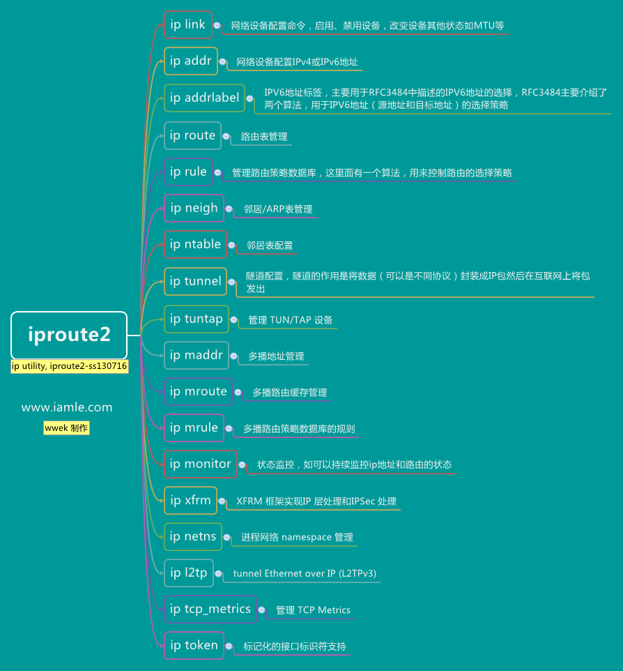
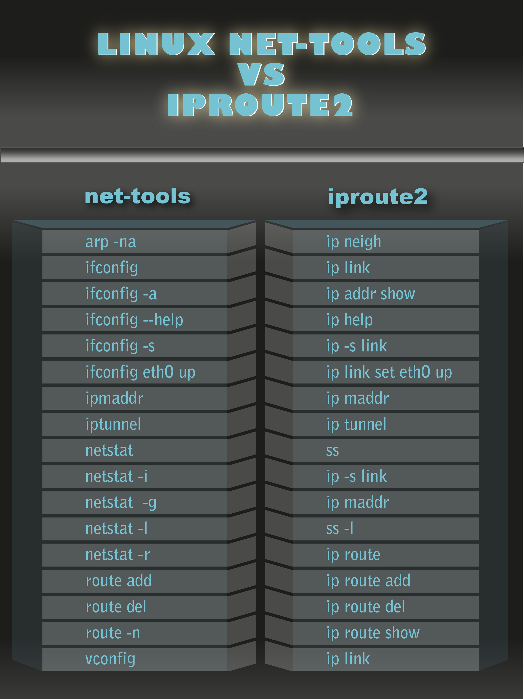

#iproute2 介绍
iproute2是一个linux下管理控制 TCP/IP 网络和流量控制的工具包，用以替代老的arp、ifconfig、route。目前由 Stephen Hemminger <shemminger@osdl.org>维护，原作者为Alexey Kuznetsov，原作者是linux内核中Qos实现作者。

iproute2包含所有网络方面的配置功能，还包括流量控制，网上大多数教程还在使用ifconfig、route、arp来配置，在centos7中已经默认不包含ifconfig、route、arp命令了，建议广大系统管理员，运维人员过度使用iproute2工具包相关命令。
iproute2工具包其中包含的命令有：

* ip命令，主要的配置命令，可以配置 IPv4 和 IPv6
* tc命令，主要的配置命令，用来进行流量控制（traffic control）  
* rtmon命令是用来产生链接、地址、路由信息记录文件的命令  
* rtacct命令用来查看数据包流量状态的命令  
* ifcfg命令，类似以前的ifconfig命令，进行网络地址管理，用whereis命令找到ifcfg实际上这货是个bash shell脚本，调用的ip命令
大多数linux发行版都自带了iproute2，不需要单独安装。
本文主要介绍iproute2的ip命令使用

#思维导图

iproute2 ip思维导图

旧命令 和 iproute2命令集对比

