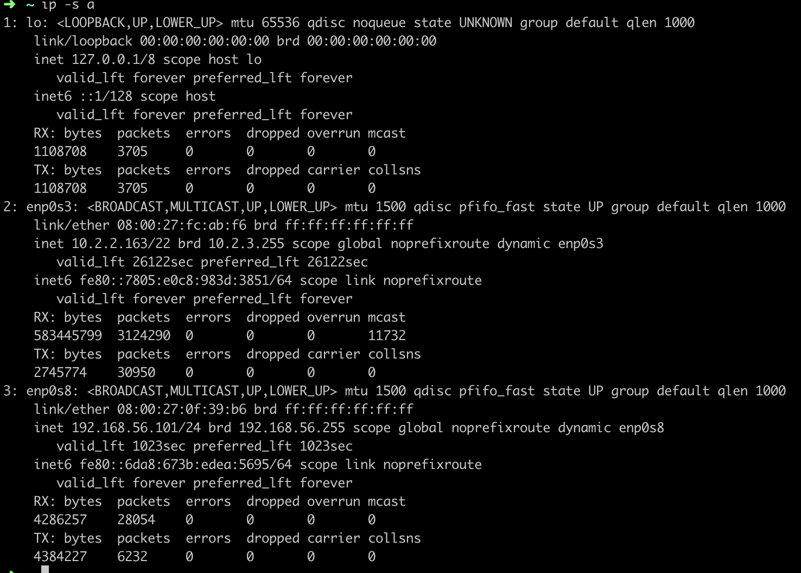

[TOC]

参考：https://blog.csdn.net/freeking101/article/details/68939059

## iproute2 对象

> ```bash
> link 网络设备
> address 设备上的协议（IP或IPv6）地址
> addrlabel 协议地址选择的标签配置
> neighbour ARP或NDISC缓存条目
> route 路由表条目
> rule 路由策略数据库中的规则
> maddress 组播地址
> mroute 组播路由缓存条目
> tunnel IP隧道
> xfrm IPSec协议框架
> ```

## iproute2 选项
>```bash
>-V，-Version 显示指令版本信息
>-s,-stats,statistics 输出详细信息
>-h,-human,-human-readable 输出人类可读的统计信息和后缀
>-iec 以IEC标准单位打印人类可读速率（例如1K=1024）
>-f,-family <FAMILY> 指定要使用的协议族。协议族标识可以是inet、inet6、ipx、dnet或link之一。如果此选项不存在，则从其他参数中推测协议族。如果命令行的其余部分没有提供足够的信息来推测该族，则ip会退回到默认值，通常是inet或any。link是一个特殊的系列标识符，表示不涉及网络协议。
>-4 –family inet的快捷方式
>-6 –family inet6的快捷方式
>-0 –family link的快捷方式
>-o,-oneline 将每条记录输出到一行，用’\’字符替换换行符。
>-r,-resolve 使用系统名称解析程序来打印DNS名称而不是主机地址。
>```


## iproute2 ip 命令常用备忘
```bash
# ip地址管理
    1. 显示ip地址
        ip -s address
        ip addr show
        ip addr show dev eth0
        ip addr sh eth0
    2. 增加删除地址
        ip address add 192.0.2.1/24 dev eth0	#添加网卡别名
        ip addr del 192.0.2.2/24 dev eth0
    3. 显示接口统计
        ip -s link list eth0
# 网卡和链路配置
    4.显示链路
        ip link show
        ip link sh eth0
    4.修改接口状态
        ip link set eth0 up
        ip link s gre01 down
# 路由表管理
    5.显示路由表
        ip route
        ip ro show dev gre01
        ip route show table local                #查看本地静态路由
    		ip route show table main                 #查看直连路由
    6.增加新路由
        ip route add 10.2.2.128/27 dev gre01
    7.增加默认路由
        ip route add default via 192.168.1.1
    8.修改默认路由
        ip route chg default via 192.168.1.2
    9.删除默认路由
        ip route del default dev eth0
# 隧道配置
    10.增加删除GRE隧道
        ip tunnel add gre01 mode gre local 10.1.1.1 remote 20.2.2.1 ttl 255
        ip tunnel del gre01
    11.IPIP隧道
        ip tunl a ipip01 mode ipip local 10.1.1.1 remote 20.2.2.1 ttl 255
    12.显示隧道
        ip tunnel show
    13.显示隧道统计
        ip -s tunl list gre01
# 邻居和arp表管理
    13.查看arp表
        ip neigh show
    14.手工增加删除arp项
        ip neighbor add 10.2.2.2 dev eth0
        ip neigh del 10.2.2.1 dev eth0
# socket统计
    15.显示当前监听
        ss -l
    15.显示当前监听的进程
        ss -p
# 路由表规则
		16. ip rule show  #显示缺省规则
		
```

### 设置网络设备的IP地址

1. 使用net-tools：
```bash
root@astrol:~# ifconfig eth0:1 192.168.6.140  
root@astrol:~# ifconfig eth0:1 192.168.6.140 netmask 255.255.255.0  
root@astrol:~# ifconfig eth0:1 192.168.6.140 netmask 255.255.255.0 broadcast 192.168.6.255  
```

2. 使用iproute2：
```bash
root@astrol:~# ip addr add 192.168.6.140/24 brd + dev eth0:1  
```

这里使用的模版是：`ip addr add ip_address/net_prefix brd + devinterface`
net_prefix隐含指定了子网掩码，brd +表明是标准的广播地址。
需要了解的一点是，通过ip addr可以非常容易地给一块网卡添加多个地址，ifconfig同样可以，是通过叫做“IP别名”的方式做到的。

```bash
root@astrol:~# ip addr add 192.168.6.140/24 broadcast 192.168.6.255 dev eth0  
root@astrol:~# ip addr add 192.168.6.141/24 broadcast 192.168.6.255 dev eth0  
root@astrol:~# ip addr add 192.168.6.142/24 broadcast 192.168.6.255 dev eth0  
```

### 删除网络设备的IP地址
使用net-tools：
貌似没有什么好办法去做：`ifconfig eth0 0`  。
就IP地址的移除而言，除了给接口分配全0地址外，net-tools没有提供任何合适的方法来移除网络接口的IPv4地址
使用iproute2：
模版：`ip addr del ip_address/net_prefix dev interface`

```bash
ip addr del 192.168.6.141/24 dev eth0  
```

注：iproute2提供ip addr flush可以一次性删除一个网络设备的所有地址：

```bash
root@astrol:~# ip addr flush dev eth0 
```

默认的，这条命令会删除IPv4和IPv6的地址，如果想分别删除，可以通过分别指定-4和-6选项。

### 设置或者改变网络接口的参数（属性）

可以看到其中的up和down就是用来激活或者停用某个网络接口的。例如，使能或者**关闭eth0的多播功能**：

使用net-tools：

```bash
root@astrol:~# ifconfig eth0 multicast  
root@astrol:~# ifconfig eth0 -multicast  
```

使用iproute2：

```bash
root@astrol:~# ip link set eth0 multicast on  
root@astrol:~# ip link set eth0 multicast off  
```

通常，**调整最大传输单元MTU**用的比较多。

使用net-tools：

```bash
root@astrol:~# ifconfig eth0 mtu 1400  
root@astrol:~# ip link show eth0  
```

使用iproute2：

```bash
root@astrol:~# ip link set eth0 mtu 1500  
root@astrol:~# ip link show eth0  
```

**改变网卡硬件地址**，即MAC地址（注意，修改MAC地址前网卡必须先关闭）：

使用net-tools：

```bash
root@astrol:~# ifconfig eth0 down  
root@astrol:~# ifconfig eth0 hw ether 00:0c:29:0d:ce:95 up  
```

使用iproute2：

```bash
root@astrol:~# ip link set eth0 down  
root@astrol:~# ip link set eth0 address 00:0c:29:0d:ce:95  
root@astrol:~# ip link set eth0 up  
```

类似的，需要先关闭网卡再设置的属性有name

## 常用命令

```bash
#添加静态路由
    ip route add 10.0.0.0/24 via 192.168.92.129
    ip route add 10.10.10.10 via 192.168.92.129
    ip route add 172.31.100.0/24 dev eno16777736
    ip route add 172.32.0.2 dev eno16777736


#查看下网卡，别名没有产生，而是直接继承
    [root@localhost ~]# ip addr show eno16777736
#添加网卡别名并添加标记    label
    ip addr add 192.168.1.2 label eno16777736:0 dev eno16777736
#查看下，多了eno16777736:0
    ip addr show eno16777736
    [root@localhost ~]# ip addr add 192.168.55.191/24 label eth0:1 dev eth0
    [root@localhost ~]# ip addr show
```

## 输出解释



第一行：网卡名称   BROADCAST（支持广播）MULTICAST（支持组播） UP（代表网卡是激活状态）LOWER_UP（网卡处于联网状态）

第二行：link/ether （链接类型：Ethernet） HWaddr（网卡的硬件地址，即MAC地址）

第三行：inet addr（网卡的IPv4地址） Bcast（广播地址） ~~Mask（子网掩码）~~

第四行：inet6 addr（网卡的IPv6地址） 

第五、六行： 表示网络启动到现在接收和发送的网络包（packets）数量

> ```bash
> HWaddr :网卡的硬件地址，即MAC地址
> inet addr：IPv4的IP 地址
> Bcast：广播地址
> mask：子网掩码
> inet6 addr：IPv6地址
> MTU:最大传输单元
> Metric：用于计算路由的成本
> RX：表示网络启动到现在的封包接受情况 (Receive)
> packets:表示接包数
> errors:表示接包发生错误的数量
> dropped：表示丢弃的包数量
> overruns:表示接收时因过速而丢失的数据包数
> frame：表示发生frame错误而丢失的数据包数
> TX：从网络启动到现在传送的情况 (Transmit)
> collisions：冲突信息包的数目
> txqueuelen：发送队列的大小
> RX byte、TX byte:总传送/接受的量
> ```

注：由RX和TX可以了解网络是否非常繁忙
注：errors:0 dropped:0 overruns:0 frame:0，都为0 说明网络比较稳定
注：collisions发生太多次表示网络状况不太好