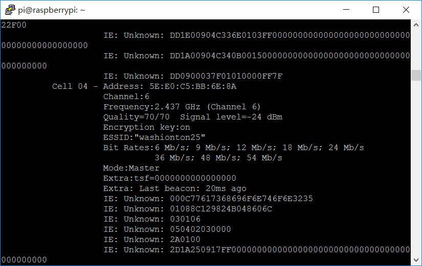
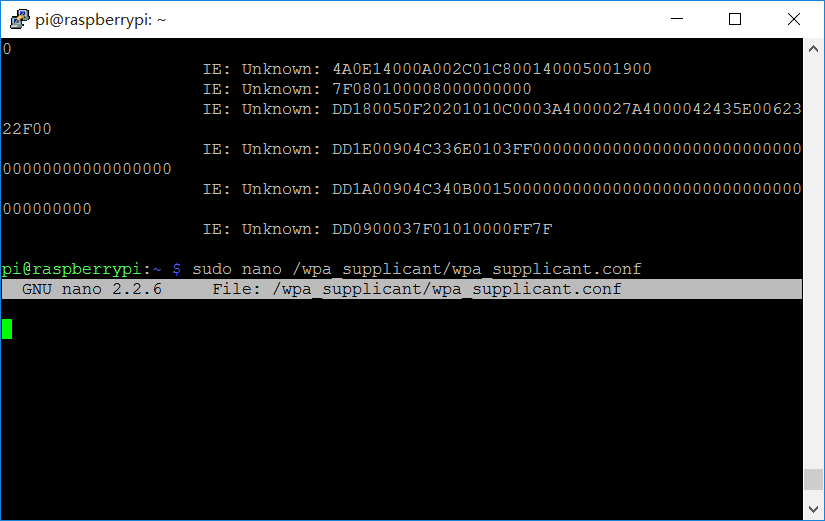

aspberry Pi，输入sudo iwlist wlan0 scan 命令，可以显示周围所有的无线网络，如下图所示，ESSID即为无线网络名:

找到自己想连接的那个网络，在最下端输入sudo nano /etc/wpa_supplicant/wpa_supplicant.conf 命令，按回车键，即可进入nano 编辑器，打开wpa_supplicant配置文件，

在文件最底部添加

network={

ssid="网络名"

psk="密码"

}

添加完之后，按ctrl+x，再按y键 最后按回车，wifi网络即可添加完成。添加wifi之后，就将电脑和Raspberry Pi都连入此wifi。
