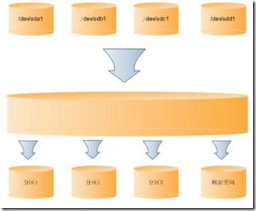

# LVM磁盘管理及LVM磁盘扩容

> 参考 : http://www.cnblogs.com/gaojun/archive/2012/08/22/2650229.html
> 当前系统 : centos 7_x64
> LVM 版本 : lvm2-2.02.130-5.el7_2.5.x86_64

## LVM 简介

**LVM**是 **Logical Volume Manager**(逻辑卷管理)的简写，它由Heinz Mauelshagen在Linux 2.4内核上实现。**LVM将一个或多个硬盘的分区在逻辑上集合，相当于一个大硬盘来使用，当硬盘的空间不够使用的时候，可以继续将其它的硬盘的分区加入其中，这样可以实现磁盘空间的动态管理，相对于普通的磁盘分区有很大的灵活性**。

与传统的磁盘与分区相比，LVM为计算机提供了更高层次的磁盘存储。它使系统管理员可以更方便的为应用与用户分配存储空间。**在LVM管理下的存储卷可以按需要随时改变大小与移除**(可能需对文件系统工具进行升级)。**LVM也允许按用户组对存储卷进行管理，允许管理员用更直观的名称**(如"sales'、 'development')**代替物理磁盘名**(如'sda'、'sdb')**来标识存储卷**。

如图所示LVM模型：


> 由四个磁盘分区可以组成一个很大的空间，然后在这些空间上划分一些逻辑分区，当一个逻辑分区的空间不够用的时候，可以从剩余空间上划分一些空间给空间不够用的分区使用。

## LVM基本术语


**LVM是在磁盘分区和文件系统之间添加的一个逻辑层，来为文件系统屏蔽下层磁盘分区布局，提供一个抽象的盘卷，在盘卷上建立文件系统**。首先我们讨论以下几个LVM术语：

**物理存储介质（The physical media）**：这里指系统的存储设备：硬盘，如：/dev/hda1、/dev/sda等等，是存储系统最低层的存储单元。

**物理卷（physical volume）**：物理卷就是指硬盘分区或从逻辑上与磁盘分区具有同样功能的设备(如RAID)，是LVM的基本存储逻辑块，但和基本的物理存储介质（如分区、磁盘等）比较，却包含有与LVM相关的管理参数。

**卷组（Volume Group）**：LVM卷组类似于非LVM系统中的物理硬盘，其由物理卷组成。可以在卷组上创建一个或多个“LVM分区”（逻辑卷），LVM卷组由一个或多个物理卷组成。

**逻辑卷（logical volume）**：LVM的逻辑卷类似于非LVM系统中的硬盘分区，在逻辑卷之上可以建立文件系统(比如/home或者/usr等)。

**PE（physical extent）**：每一个物理卷被划分为称为PE(Physical Extents)的基本单元，具有唯一编号的PE是可以被LVM寻址的最小单元。PE的大小是可配置的，默认为4MB。

**LE（logical extent）**：逻辑卷也被划分为被称为LE(Logical Extents) 的可被寻址的基本单位。在同一个卷组中，LE的大小和PE是相同的，并且一一对应。

> 简单来说就是：
> **PV** : 是物理的磁盘分区
> **VG** : LVM中的物理的磁盘分区，也就是PV，必须加入VG，可以将VG理解为一个仓库或者是几个大的硬盘。
> **LV**：也就是从VG中划分的逻辑分区
> 如下图所示PV、VG、LV三者关系：
> 

## 查看是否安装LVM
确定系统中是否安装了lvm工具：
```bash
$ rpm –qa|grep lvm
# 输出 : lvm-1.0.3-4
```

## 查看当前磁盘信息常用命令

```bash
# 列出在存储设备
$ lsblk
NAME            MAJ:MIN RM  SIZE RO TYPE MOUNTPOINT
sda               8:0    0   30G  0 disk 
├─sda1            8:1    0  500M  0 part /boot
├─sda2            8:2    0  7.5G  0 part 
│ ├─centos-root 253:0    0 26.7G  0 lvm  /
│ └─centos-swap 253:1    0  820M  0 lvm  [SWAP]
└─sda3            8:3    0   22G  0 part /var
sdb               8:16   0   20G  0 disk 
└─sdb1            8:17   0   20G  0 part 
  └─centos-root 253:0    0 26.7G  0 lvm  /
  
# 输出分区表信息
$ fdisl -l 

# 查看磁盘容量 
$ df -h

```

## 创建和管理 LVM

1. 查看当前系统的LVM磁盘, 属于LVM的分区System值为 *Linux LVM*
```bash
$ fdisk -l
# 输出 :
#Device Boot      Start         End      Blocks   Id  System
#/dev/sda1   *        2048     1026047      512000   83  Linux
#/dev/sda2         1026048    16777215     7875584   8e  Linux LVM
#/dev/sda3        16777216    62914559    23068672   8e  Linux
```
2. 将新加入的，*/dev/sda4* 加入LVM
```bash
$  fdisk /dev/sda	# 对硬盘分区表重新处理
>  n  # 新建分区(如果是/dev/sdb,操作类同)
>  p  # 创建主分区
>   4  # 创建第四分区
>  回车  # 起始柱，默认就好
>  +10G  # 如果想用整个分区空间，可直接回车
>  t  # 调整分区格式
>  8e  #LVM的分区格式为(Linux LVM,即 8e)
>  p  # 查看当前分区表
>  w  # 保存当前分区表

$  partprobe  # 立即加载当前分区表
$  mkfs -t ext3 /dev/sda4  # 格式化分区
```
3. 查看当前分区表
```bash
$ fdisk -l
# 输出 :
#Device Boot      Start         End      Blocks   Id  System
#/dev/sda1   *        2048     1026047      512000   83  Linux
#/dev/sda2         1026048    16777215     7875584   8e  Linux LVM
#/dev/sda3        16777216    62914559    23068672   83  Linux
#/dev/sda4        62914559    72914559    10068672   8e  Linux LVM
$ df -h  # 查看 LVM 卷容量
# 输出
# Filesystem               Size  Used Avail Use% Mounted on
# /dev/mapper/centos-root   19G  9.1G   10G  47% /
```

4. 将 **/dev/sda4** 挂载到 LVM
```bash
$ pvcreate /dev/sda4  # 将sda4添加到物理磁盘
$ vgdisplay  # 查看已存在的 VG 信息，获取 vg name，此处以 centos 为例
$ vgextend centos /dev/sda4  # 将sda4 分区增加到虚拟磁盘(组)centos下
$ lvdisplay  # 查看已存在 lv(逻辑卷) 信息，同样获取 lv name, 此处以 root 为例
$ lvextend -L +10G /dev/centos/root  # 将虚拟磁盘中10G空间共享给root目录，只能小于共享磁盘可用容量
$ resize2fs /dev/centos/root  # 重置 LVM 卷空间大小
$ df -h  # 查看 LVM 卷容量,已调整
# 输出
# Filesystem               Size  Used Avail Use% Mounted on
# /dev/mapper/centos-root   29G  7.1G   22G  25% /
```
注意 :
> 如果 **resize2fs** 提示异常，可以使用 **xfs_growfs** 命令替换
> ```bash
> $ xfs_growfs /dev/centos/root
> ```