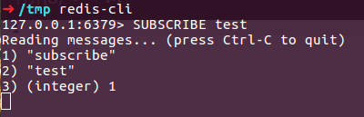
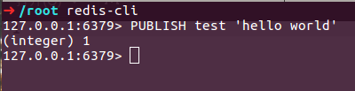
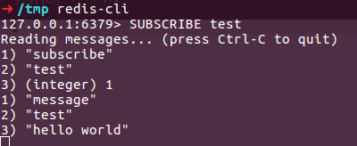

# REDIS 发布与订阅

环境 : 
> CentOS Linux release 7.4.1708
Redis server v=3.2.10

最近的一个项目需要用到发布/订阅的信息系统，以做到最新实时消息的通知。经查找后发现了redis pub/sub(发布/订阅的信息系统)可以满足我的开发需求,而且学习成本和使用成本也比较低。

### 什么是 Redis 发布与订阅
Redis 客户端可以订阅任意数量的频道。

##### Pub/Sub功能（means Publish, Subscribe）即发布及订阅功能
1. 基于事件的系统中，Pub/Sub是目前广泛使用的通信模型，它采用事件作为基本的通信机制，提供大规模系统所要求的松散耦合的交互模式：订阅者(如客户端)以事件订阅的方式表达出它有兴趣接收的一个事件或一类事件；发布者(如服务器)可将订阅者感兴趣的事件随时通知相关订阅者。

2. 消息发布者(pub)，即publish客户端，无需独占链接，你可以在publish消息的同时，使用同一个redis-client链接进行其他操作（例如：INCR等）

3. 消息订阅者(sub)，即subscribe客户端，需要独占链接，即进行subscribe期间，redis-client无法穿插其他操作，此时client以阻塞的方式等待“publish端”的消息；这一点很好理解，因此subscribe端需要使用单独的链接，甚至需要在额外的线程中使用。

4. 虽然发布与订阅是基于 redis 但并不是做为固定值保存在redis中，也无法用 get key 之类方法查看消息内容。消息在发布与分发后便消失了。

### redis pub sub(publish subscribe)之基本使用
1 . **启动 redis 服务**
```shell
/tmp> systemctl start redis-server
```
2 . **打开redis客户端，订阅频道**
 
3 . **另打开一个 redis 客户端，作为发布端**
 
4 . **查看订阅端消息**
 

### 模式匹配订阅

1 .  **订阅多个模式**
```shell
redis> psubscribe news.* tweet.*
Reading messages... (press Ctrl-C to quit)
1) "psubscribe"                  # 返回值的类型：显示订阅成功
2) "news.*"                      # 订阅的模式
3) (integer) 1                   # 目前已订阅的模式的数量

1) "psubscribe"
2) "tweet.*"
3) (integer) 2

1) "pmessage"                    # 返回值的类型：信息
2) "news.*"                      # 信息匹配的模式
3) "news.it"                     # 信息本身的目标频道
4) "Google buy Motorola"         # 信息的内容

1) "pmessage"
2) "tweet.*"
3) "tweet.huangz"
4) "hello"
```

2 . **向订阅模式推送消息**
```shell
redis> PUBLISH news.a 'hello news a'
```
3 . **退订模式**
```shell
redis> PUNSUBSCRIBE news.*   # 我的环境中并没有起到什么作用
```
