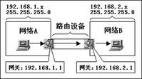

[TOC]

### Mac地址

网卡地址

相当于门牌号，这个是写到网卡里，且各网卡厂商约定各自唯一的网卡地址。

### IP地址

网络地址

相当于快递地址，在网络上以ip地址寻址。一个网络内IP地址不能重复。

### 网关

网间连接器

相当于门岗，网关实质上是一个网络通向其他网络的IP地址。比如有网络A和网络B，网络A的IP地址范围为“192.168.1.1~192. 168.1.254”，子网掩码为255.255.255.0；网络B的IP地址范围为“192.168.2.1~192.168.2.254”，子网掩码为255.255.255.0。在没有路由器的情况下，两个网络之间是不能进行TCP/IP通信的，即使是两个网络连接在同一台交换机或集线器上，TCP/IP协议也会根据子网掩码（255.255.255.0）判定两个网络中的主机处在不同的网络里。而要实现这两个网络之间的通信，则必须通过网关。如果网络A中的主机发现数据包的目的主机不在本地网络中，就把数据包转发给它自己的网关，再由网关转发给网络B的网关，网络B的网关再转发给网络B的某个主机（如附图所示）。网络A向网络B转发数据包的过程。

#### 网关的自动设置 

自动设置就是利用**DHCP（Dynamic Host Configuration Protocol, 动态主机配置协议）服务器**来自动给网络中的电脑分配IP地址、子网掩码和默认网关 。这样做的好处是一旦网络的默认网关发生了变化时，只要更改了DHCP服务器中默认网关的设置，那么网络中所有的电脑均获得了新的默认网关的IP地址。这种方法适用于网络规模较大、TCP/IP参数有可能变动的网络。

### DNS

**域名系统**（域名解析服务器，**D**omain **N**ame **S**ystem）
故名思意，是将域名解析为IP地址的服务，一般来说只有http服务会用到。如果是IP直接通信，就不用DNS了。

### routing table

**路由表**（**路由表**（routing table）或称**路由择域信息库**（RIB, Routing Information Base））

相当于通讯录，可以根据路由表查询目的IP访问路径。路由表存储着指向特定网络地址的路径（在有些情况下，还记录有路径的路由度量值）。路由器的主要工作就是为经过路由器的每个数据包寻找一条最佳的传输路径，并将该数据有效地传送到目的站点。由此可见，选择最佳路径的策略即路由算法是路由器的关键所在。为了完成这项工作，在路由器中保存着各种传输路径的相关数据——路由表（Routing Table），供路由选择时使用，表中包含的信息决定了数据转发的策略。

#### DDOS攻击

#### 路由欺骗

#### 拒绝服务攻击

### ARP

相当于快递地址与门牌号的记录，其本质就是一个IP地址-->MAC地址的对应表。

地址解析协议，即ARP（Address Resolution Protocol），是根据IP地址获取物理地址的一个TCP/IP协议。主机发送信息时将包含目标IP地址的ARP请求广播到局域网络上的所有主机，并接收返回消息，以此确定目标的物理地址；收到返回消息后将该IP地址和物理地址存入本机ARP缓存中并保留一定时间，下次请求时直接查询ARP缓存以节约资源。

当地址解析协议被询问一个已知IP地址节点的MAC地址时，先在ARP缓存中查看，若存在，就直接返回与之对应的MAC地址，若不存在，才发送ARP请求向局域网查询。

#### ARP欺骗

地址解析协议是建立在网络中各个主机互相信任的基础上的，局域网络上的主机可以自主发送ARP应答消息，其他主机收到应答报文时不会检测该报文的真实性就会将其记入本机ARP缓存；由此攻击者就可以向某一主机发送伪ARP应答报文，使其发送的信息无法到达预期的主机或到达错误的主机，这就构成了一个[ARP欺骗](https://baike.baidu.com/item/ARP欺骗)。

### 子网掩码

子网掩码(subnet mask)又叫网络掩码、地址掩码、子网络遮罩，它是一种用来指明一个IP地址的哪些位标识的是主机所在的子网，以及哪些位标识的是主机的位掩码。子网掩码不能单独存在，它必须结合IP地址一起使用。子网掩码只有一个作用，就是将某个IP地址划分成网络地址和主机地址两部分。

Internet网络中,每个上网的计算机都有一个像上述例子的地址,这个地址就是IP地址,是分配给网络设备的门牌号,为了网络中的计算机能够互相访问,IP地址=网络地址+主机地址,图1中的IP地址是192.168.100.1,这个地址中包含了很多含义.如下所示:

网络地址(相当于街道地址): 192.168.100.0 
主机地址(相当于各户的门号): 0.0.0.1 
IP地址(相当于住户地址): 网络地址+主机地址=192.168.100.1 
广播地址: 192.168.100.255 

**一、 为什么要计算网络地址** 

1. 设置1号机的IP地址为192.168.0.1子网掩码为255.255.255.0,2号机的IP地址为192.168.0.200子网掩码为255.255.255.0,这来台计算机就能正常通讯.

2. 如果1号机地址不变,将2号机的IP地址改为192.168.1.200子网掩码还是为255.255.255.0,那这两台就无法通讯.

3. 设置1号机的IP地址为192.168.0.1子网掩码为255.255.255.192,2号机的IP地址为192.168.0.200子网掩码为255.255.255.192,注意和第1种情况的区别在于子网掩码,1为255.255.255.0本例是255.255.255.192。这台计算机就不能正常通讯. 

> 第1种情况能通是因为这两台计算机处在同一网络192.168.0.0,所以能通,而2,3种情况下两台计算机处在不同的网络,所以不通. 
>
> **计算网络地址就是判断网络中的计算机在不在同一网络,在就能通,不在就不能通**.

**二,如何计算网络地址 （子网掩码）**

我们从IP地址中却难以看出网络地址,要计算网络地址,必须借助我们上边提到过的子网掩码。