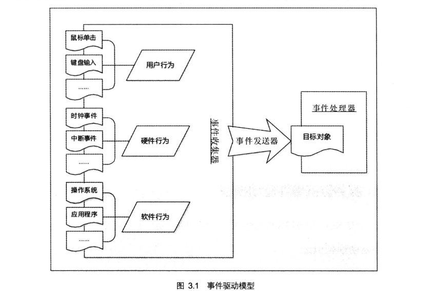

#Nginx_事件处理机制

## 事件驱动模型概述

顾名思义，事件驱动就是在持续事务管理过程中，由当前时间点上出现的事件引发的调动可用资源执行相关任务，解决不断出现的问题，防止事务规程的一种策略。在计算机编程领域，事件驱动模型对应一种程序设计方式，`Event-driven programming`，即事件驱动程序设计。

**事件驱动模型**一般是由 **事件收集器**，**事件发送器**和 **事件处理器** 三部分基本单元组成。

其中，**事件收集器** 专门负责收集所有的事件，包括来自用户的，来自硬件的和来自软件的。**事件发送器** 负责将收集器收集到的事件分发到目标对象中。**目标对象** 就是事件处理器所处的位置。**事件处理器** 主要负责具体事件的响应工作，它往往要到实现阶段才完全确定。



## 事件驱动处理库

Nginx 的 **事件收集器** 和 **事件发送器** 的实现没有太大的特点，我们重点介绍一下它的 **事件处理器**。

通常，我们在编写服务器处理模型的程序时，基于事件驱动模型，**目标对象** 中的 **事件处理器** 可以有以下几种实现办法 :

- **事件发送器** 每传递过来一个请求，**目标对象** 就创建一个新的`进程`，调用 **事件处理器** 来处理该请求。
- **事件发送器** 每传递过来一个请求，**目标对象** 就创建一个新的`线程`，调用 **事件处理器** 来处理该请求。
- **事件发送器** 每传递过来一个请求，**目标对象** 就将其放入一个待处理事件的列表，使用非阻塞 I/O 方式调用 **事件处理器** 来处理该请求。

上面三种处理方式，各有 :
> 第一种方式，由于创建新的进程的开销比较大，会导致服务器性能比较差，但其实现相对来说比较简单；
>
> 第二种方式，由于要涉及到线程的同步，故可能会面临死锁，同步等一系列问题，编码比较复杂;
>
> 第三种方式，在编写程序代码时，逻辑比前面两种都复杂。


## 从阻塞到非阻塞

- `多线程模型适用于处理短连接，且连接的打开关闭非常频繁的情形，但不适合处理长连接`。多线程模型默认情况下，（在Linux）每个线程会开8M的栈空间，再TCP长连接的情况下，2000/分钟的请求，假定有10000个连接，开这么多个线程需要10000*8M=80G的内存空间！`这不同于多进程模型，线程间内存无法共享，因为所有线程处在同一个地址空间中。内存是多线程模型的软肋`。
- `在UNIX平台下多进程模型擅长处理并发长连接，但却不适用于连接频繁产生和关闭的情形`。fork产生的进程和父进程共享了很大一部分物理内存。但是多进程模型在执行效率上太低，接受一个连接需要几百个时钟周期，产生一个进程 可能消耗几万个CPU时钟周期，两者的开销不成比例。`在CPU能力不足的情况下同样容易遭受DDos，攻击者只需要连上服务器，然后立刻关闭连接，服务端则需要打开一个进程再关闭`。
- `同时需要保持很多的长连接，而且连接的开关很频繁，最高效的模型是非阻塞、异步IO模型`。由于I/O操作不再阻塞，报文的解析需要小心翼翼，并且需要亲自管理维护每个链接的状态。并且为了充分利用CPU，还应结合线程池，避免在轮询线程中处理业务逻辑。但这种模型的效率是极高的。`这使得DDoS攻击者的成本大大增加，这种模型攻击者只能将服务器的带宽全部占用，才能达到目的，而两方的投入是不成比例的`。

```
while true {
	for i in stream[]; {
		if i has data
			read until unavailable
	}
}
```

大多数网络服务器采用了第三种方式，逐渐形成了所谓的 **事件驱动处理库**。

**事件驱动处理库** 又被称为**多路 IO 复用方法**，最常见的包括以下三种：`select 模型`,`poll 模型` 和 `epoll 模型`。Nginx 服务器还支持 `rtsig 模型`，`kqueue 模型`，`dev/poll 模型` 和 `eventport 模型` 等。

## select 库

**select 库**，是各个版本的 Linux 和 Windows 平台都支持的基本事件驱动模型库，并且在接口的定义上也基本相同，只是部分参数含义略有差异。使用 **select 库** 的步骤一般是 :

首先，创建所关注事件的描述符集合。对于一个描述符，可以关注其上面的读(Read) 事件，写 (Write) 事件以及异常发生 (Exception) 事件，所以要创建三类事件描述符集合，分别用来收集读事件的描述符，写事件的描述符和异常事件的描述符。

其次，调用底层提供的 `select()` 函数，等待事件发生。这里需要注意的一点是， select 的阻塞与是否设置非阻塞 I/O 是没有关系的。

然后，轮询所有事件描述集合中的每一个事件描述符，检查是否有相应的事件发生，如果有，就进行处理。

```
while true {
	select(streams[])
	for i in streams[] {
		if i has data
			read until unavailable
	}
}
```

> select 库的缺点 ：
>
> 1. 每次都需要把描述符fd集合从用户空间复制到内核空间，会有一定量开销，由其在fd集合很大的时候;
>
> 2. select 支持的文件描述符数量太小了，默认是1024。

## poll 库

**poll 库**，作为 Linux 平台上的基本事件驱动模型，是在 Linux 2.1.23 中引入的。 Windows 平台不支持**poll 库**。

**poll** 和 **select** 的基本工作方式是相同的，都是先创建一个关注事件的描述符集合，再去等待这些事件发生，然后再轮询描述符集合，检查有没有事件发生，如果有，就进行处理。

**poll** 和 **select** 的主要区别在于，**select 库** `需要为读事件，写事件和异常事件分别创建一个描述符集合，因此在最后的时候，需要分别轮询的时候，需要分别轮询这三个集合`。而 **poll 库** `只需要创建一个集合，在每个描述符对应的结构上分别设置读事件，写事件或者异常事件，最后轮询的时候，可以同时检查这三种事件是否发生`。可以说，**poll 库** 是 **select 库** 的优化实现。

## epoll 库

**epoll 库** 是 Nginx 服务器支持的高性能事件驱动库之一，它是公认的非常优秀的事件驱动模型，和 **poll 库** 和 **select 库** 有很大的不同。**epoll** 属于 **poll 库** 的一个变种，是在 Linux 2.5.44 中引入的，在 Linux 2.6 及以上的版本都可以使用它。**poll 库** 和 **select 库** 在实际工作中，最大的区别在于效率。

**epoll 库** 是`把描述符列表的管理交由内核负责，一旦有某种事件发生，内核把发生事件的描述符列表通知给进程，这样就避免了轮询整个描述符列表`。

首先，**epoll 库** `通过相关调用通知内核创建一个有 N 个描述符事件列表`;然后，`给这些描述符设置所关注的事件，并把它添加到内核的事件列表中去`，在具体的编码过程中也可以通过相关调用对事件列表中的描述符进行修改或删除。

完成设置之后，**epoll 库** 就开始等待内核通知事件了。某一事件发生后，内核将发生事件的描述符列表上报给 **epoll 库**。得到事件列表的 **epoll 库**，就可以进行事件处理了。

> **epoll 库** 在 Linux 平台上是高效的。它支持一个进程打开大数目的事件描述符，上限是系统可以打开文件的最大数目；同时，**epoll 库** 的 IO 效率不随描述符数目增加而线性下降，因为它只会对内核上报的 "活跃" 的描述符进行操作。

```
while true {
	active_stream[] = epoll_wait(epollfd)
	for i in active_stream[] {
		read or write till
	}
}
```

## select,poll和epoll的比较
相对于 **select** 和 **poll**, **epoll** 会有如下调整：

> 1. 每次注册新的事件到epoll句柄中时（在epoll_ctl中指定EPOLL_CTL_ADD），会把所有的fd拷贝进内核，而不是在epoll_wait的时候重复拷贝。epoll保证了每个fd在整个过程中只会拷贝一次。
>
> 2. epoll的解决方案不像select或poll一样每次都把current轮流加入fd对应的设备等待队列中，而只在epoll_ctl时把current挂一遍（这一遍必不可少）并为每个fd指定一个回调函数，当设备就绪，唤醒等待队列上的等待者时，就会调用这个回调函数，而这个回调函数会把就绪的fd加入一个就绪链表）。epoll_wait的工作实际上就是在这个就绪链表中查看有没有就绪的fd（利用schedule_timeout()实现睡一会。
>
> 3. epoll没有这个限制，它所支持的FD上限是最大可以打开文件的数目，这个数字一般远大于2048,举个例子,在1GB内存的机器上大约是10万左右，具体数目可以cat /proc/sys/fs/file-max察看,一般来说这个数目和系统内存关系很大。