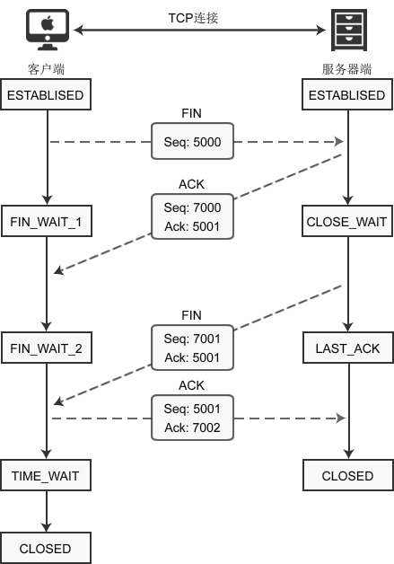

### TCP 概述

　TCP提供一种面向连接的、可靠的字节流服务。面向连接意味着两个使用TCP的应用（通常是一个客户和一个服务器）在彼此交换数据包之前必须先建立一个TCP连接。在一个TCP连接中，仅有两方进行彼此通信。广播和多播不能用于TCP。

> **软件名称** 传输控制协议
> **英文名** Transmission Control Protocol
> **简称** TCP
> **行业标准** IETF RFC 793

##TCP 首部格式

TCP 数据报格式:

带阴影的几个字段需要重点说明一下：
1. 序号：Seq（Sequence Number）序号占32位，用来标识从计算机A发送到计算机B的数据包的序号，计算机发送数据时对此进行标记。

2. 确认号：Ack（Acknowledge Number）确认号占32位，客户端和服务器端都可以发送，Ack = Seq + 1。

3. 标志位：每个标志位占用1Bit，共有6个，分别为 URG、ACK、PSH、RST、SYN、FIN，具体含义如下：

    URG：紧急指针（urgent pointer）有效。
    ACK：确认序号有效。
    PSH：接收方应该尽快将这个报文交给应用层。表示Push功能,RST表示复位TCP连接。
    RST：重置连接。
    SYN：建立一个新连接。
    FIN：断开一个连接。

    > 对英文字母缩写的总结：Seq 是 Sequence 的缩写，表示序列；Ack(ACK) 是 Acknowledge 的缩写，表示确认；SYN 是 Synchronous 的缩写，愿意是“同步的”，这里表示建立同步连接；FIN 是 Finish 的缩写，表示完成。

4. 其他

	选项 | 备注
	---|---
	`Source Port` 源端口 | 16位
	`Destination Port`目的端口 | 16 位
	`Sequence Number`序号  | 是发送数据包中的第一个字节的序列号，32 位
	`Acknowledgment Number`是确认序列号 | 32 位
	`Data Offset`是数据偏移 | 4位,该字段的值是TCP首部(包括选项)长度除以4
	标志位 |  6位
    `Window` | 表示接收缓冲区的空闲空间,16位,用来告诉TCP连接对端自己能够接收的最大数据长度。
	`Checksum`是校验和 | 16位
	`Urgent Pointers`是紧急指针 | 16位,只有URG标志位被设置时该字段才有意义,表示紧急数据相对序列号(`Sequence Number`字段的值)的偏移。

##TCP 传输流程

1. 应用层向 TCP 层发送用于网间传输的、用8位字节表示的数据流;
2. TCP 则把数据流分割成适当长度的报文段,最大传输段大小(**MSS**)通常受该计算机连接的网络的数据链路层的最大传送单元(**MTU**)限制;
3. TCP 把结果包传给 IP 层,由它来通过网络将包传送给接收端实体的 TCP 层。

TCP 为了保证不发生丢包,就给每个包一个序号,同时序号也保证了传送到接收端实体的包的按序接收。然后接收端实体对已成功收到的包发回一个相应的确认(**ACK**);如果发送端实体在合理的往返时延(**RTT**)内未收到确认,那么对应的数据包就被假设为已丢失将会被进行重传。TCP 用一个校验和函数来检验数据是否有错误;在发送和接收时都要计算校验和。

- 在数据正确性与合法性上,TCP用一个校验和函数来检验数据是否有错误,在发送和接收时都要计算校验和;同时可以使用md5认证对数据进行加密。
- 在保证可靠性上,采用超时重传和捎带确认机制。
- 在流量控制上,采用滑动窗口协议,协议中规定,对于窗口内未经确认的分组需要重传。

在拥塞控制上,采用广受好评的**TCP拥塞控制算法**(也称**AIMD算法**)。该算法主要包括三个主要部分 :

1. 加性增、乘性减;
2. 慢启动;
3. 对超时事件做出反应。

**连接建立**

TCP三次握手的过程如下 :

1. 客户端发送SYN(SEQ=x)报文给服务器端,进入SYN_SEND状态。
2. 服务器端收到SYN报文,回应一个SYN (SEQ=y)ACK(ACK=x+1)报文,进入SYN_RECV状态。
3. 客户端收到服务器端的SYN报文,回应一个ACK(ACK=y+1)报文,进入Established状态。

三次握手完成,TCP客户端和服务器端成功地建立连接,可以开始传输数据了。三次握手目的 : 就是分配资源，初始化序列号，这时还不涉及数据传输。

**连接终止**

建立一个连接需要三次握手,而终止一个连接要经过四次握手,这是由TCP的半关闭(half-close)造成的。具体过程如下图所示。

1. 某个应用进程首先调用close,称该端执行"主动关闭"(active close)。该端的TCP于是发送一个FIN分节,表示数据发送完毕。
2. 接收到这个FIN的对端执行 "被动关闭"(passive close),这个FIN由TCP确认。
3. 一段时间后,接收到这个文件结束符的应用进程将调用close关闭它的套接字。这导致它的TCP也发送一个FIN。
4. 接收这个最终FIN的原发送端TCP(即执行主动关闭的那一端)确认这个FIN。

> 注意:**FIN**的接收也作为一个文件结束符(end-of-file)传递给接收端应用进程,放在已排队等候该应用进程接收的任何其他数据之后,因为,FIN的接收意味着接收端应用进程在相应连接上再无额外数据可接收。
既然每个方向都需要一个FIN和一个ACK,因此通常需要4个分节。

补充:

1. “通常”是指，某些情况下，步骤1的FIN随数据一起发送，另外，步骤2和步骤3发送的分节都出自执行被动关闭那一端，有可能被合并成一个分节。
2. 在步骤2与步骤3之间，从执行被动关闭一端到执行主动关闭一端流动数据是可能的，这称为“半关闭”（half-close）。
3. 当一个Unix进程无论自愿地（调用exit或从main函数返回）还是非自愿地（收到一个终止本进程的信号）终止时，所有打开的描述符都被关闭，这也导致仍然打开的任何TCP连接上也发出一个FIN。

无论是客户还是服务器，任何一端都可以执行主动关闭。通常情况是，客户执行主动关闭，但是某些协议，例如，HTTP/1.0却由服务器执行主动关闭。

**关于 TIME_WAIT 状态的说明**

客户端最后一次发送 ACK包后进入 TIME_WAIT 状态，而不是直接进入 CLOSED 状态关闭连接，这是为什么呢？

TCP 是面向连接的传输方式，必须保证数据能够正确到达目标机器，不能丢失或出错，而网络是不稳定的，随时可能会毁坏数据，所以机器A每次向机器B发送数据包后，都要求机器B”确认“，回传 ACK   包，告诉机器A我收到了，这样机器A才能知道数据传送成功了。如果机器B没有回传 ACK 包，机器A会重新发送，直到机器B回传 ACK 包。

客户端最后一次向服务器回传 ACK 包时，有可能会因为网络问题导致服务器收不到，服务器会再次发送 FIN 包，如果这时客户端完全关闭了连接，那么服务器无论如何也收不到 ACK 包了，所以客户端需要等待片刻、确认对方收到 ACK 包后才能进入 CLOSED 状态。那么，要等待多久呢？

数据包在网络中是有生存时间的，超过这个时间还未到达目标主机就会被丢弃，并通知源主机。这称为报文最大生存时间（MSL，**Maximum Segment Lifetime**）。**TIME_WAIT** 要等待 2MSL 才会进入 CLOSED 状态。ACK 包到达服务器需要 MSL 时间，服务器重传 FIN 包也需要 MSL 时间，2MSL 是数据包往返的最大时间，如果 2MSL 后还未收到服务器重传的 FIN 包，就说明服务器已经收到了 ACK 包。

##TCP 协议的特点

1. TCP 协议是一对一协议（不同于 UDP 的一对多协议）;
2. TCP 协议是有序协议, 只有发送数据得到对方的返回后才会发送下面的数据包(不同于 UDP 协议, 发送出去或是接收到的数据报都没有固定顺序, 但在接收后会进行排序);
3. TCP 协议是可靠的协议, 如果对方无返回确认接收或接收数据报不完整, TCP 协议会重新补发;
4. TCP 协议没有明确的记录边界, (不同于 UDP 协议, 每个数据包都有明确的报头与边界);
5. TCP 协议是字节流协议, 收到数据并不是立即发送出去, 而是多个数据报集中在一个较大的数据报来发送。接收进程无法识别每个数据报的记录边界;
6. TCP 由于以上机制对网络和系统资源要求较高, 可能有超时现象发生(不同于 UDP 协议, 不用握手协议, 直接发送，没有顺序，没有接收反馈等，可以一对多);
7. TCP 协议有流量控制(不同于 UDP 协议, 没有流量控制, 超出接收缓冲区将会出现数据报丢弃的现象。UDP 并不会通知发送端减缓数据发送速率);
8. TCP 要求对方不能为广播类(而 UDP 可以以任何主机形式发送[不用获取发送端的IP])

##目前 TCP 前途如何

由于 TCP 协议需要消耗大量资源，并且对网络的稳定性要求较高，且有高延迟，只能一对一进行数据交互等缺点。

在linux 内核2.6以后加入了 epull， 使 TCP 实现并发过万。

有些软件开启一个 TCP 连接确保用户的登陆后，使用 UDP 协议，进行数据传输。比如QQ了天，语音和视频的传输。

有些则将 UDP 给伪装成 TCP 协议的样子，在接收到 UDP 发送的消息后, 再用 UDP 反馈一条确认信息。这是为什么明明对主收到信息，自己还会收到发送失败，原因就是服务器的 UDP 确认信息没被客户端接收到。类似这种做法的还有Google 的 Quic 新协议, 传闻其正提出将此协议替换掉 TCP 协议。

TCP 支持的应用层协议主要有: Telnet、FTP、SMTP等
UDP 支持的应用层协议主要有：NFS(网络文件系统)、SNMP(简单网络管理协议)、DNS(主域名称系 统)、TFTP(通用文件传输协议)等.

