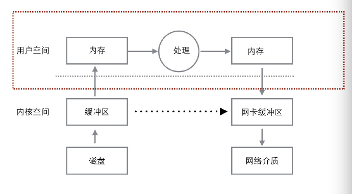

# Linux_sendfile优势小记

**sendfile** 是 **linux2+** version 提供的系统调用，而且在 **linux2.4+** version 版本之后提供能 `zero-copy` 特性， **sendfile** 为我们的程序`提高了问静态文件处理的能力和性能`。

## 原始文件传输逻辑

```
	read(file,tmp_buf, len);
	write(socket,tmp_buf, len);
```

**文件读取以发送至网络流程图**



先看上图，使用 **read** 和 **write** 方式的时候，将文件输出到网络的流程是这样的 :

1. **read** 操作先将上下文环境调整，使`线程从用户模式切换到内核模式`，将`文件从磁盘读到内核缓冲区`;
2. **read** `将文件从内核缓冲区读到用户地址空间`，同时当前上下文环境调整，`线程从内核模式切换到用户模式`;
3. **read** 返回。
4. 对文件进行处理。
5. **write** 将上下文环境调整，`线程从用户态切换到内核态`, **将文件写到操作系统内核网络部分的缓冲区**;
6. **write** `将线程切换回用户态并返回`。

## sendfile

之前的过程中涉及到上下文的切换，代价是昂贵的。由于事实上我们并不需要静态文件进行处理这个步骤。 用 `sendfile()`来进行网络传输的过程：

```
sendfile(socket,file, len);
```

再来看看 **sendfile** 的处理流程 :

1. 将文件读到系统的内核缓冲区;
2. 将文件 **copy** 到操作系统跟网络相关的内核缓冲区。

简单说，**sendfile** 是个比 **read** 和 **write** 更高性能的系统接口， 不过需要注意的是，`sendfile 是将 in_fd 的内容发送到 out_fd 。而 in_fd 不能是 socket ， 也就是只能文件句柄`。 所以当 `Nginx 是一个静态文件服务器的时候，开启 SENDFILE 配置项能大大提高 Nginx 的性能`。 但是`当 Nginx 是作为一个反向代理来使用的时候，SENDFILE 则没什么用了`。因为 Nginx 是反向代理的时候, `in_fd 就不是文件句柄而是 socket，此时就不符合 sendfile 函数的参数要求了`。