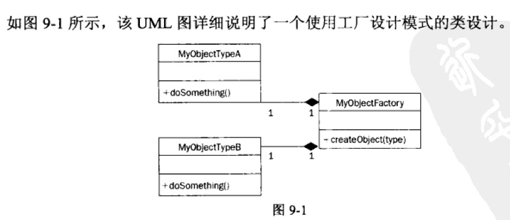

# 工厂模式_php

<!-- create time: 2016-10-09 20:48:18  -->

<!-- This file is created from $MARBOO_HOME/.media/starts/default.md
本文件由 $MARBOO_HOME/.media/starts/default.md 复制而来 -->

**名称 : 外观**

    工厂设计模式提供获取某个对象的新实例的一个接口，同时使调用代码避免确定实际实例化基类的步骤。
    
工厂模式可以创建不同的对象， 使用基于工厂设计模式的类的另一个场合是处理若干项的集合。在这种情况下， 对象集合包含相同的基对象， 但是每个对象都具有不同的特征。

> - 现存的两个基类 `MyObjectTypeA` 和 `MyObjectTypeB` 。这两个类都具有名为 `doSomething()` 的公共方法，该方法采用自己独特的方式执行具体对象的逻辑。两个基类的公共接口和返回类型是完全相同的。
> - `MyObjectFactory` 类用于创建上述任意一个基类的实例并将其返回至代码流。它具有一个名为 `createObject()` 的公共方法， 该方法接受参数 `type` ，这有助于判断应当创建哪一个基类的实例。随后， `createObject()` 方法会返回被请求类型类的一个实例。

代码示例如下 : 

    class CD
    {
        public $title = '';
        public $band = '';
        public $tracks = array();
        
        public function __construct() {}
        
        public function setTitle($title) {
            $this->title = $title;
        }
        
        public function setBand($band) {
            $this->band = $band;
        }
        
        public function addTrack($track) {
            $this->tracks[] = $track;
        }
    }
    
----

    $title = 'Waste of a Rib';
    $band = 'Never Again';
    $tracksFromExternalSource = array('What It Means', 'Brrr', 'GoodBye');
    
    $cd = new CD();
    $cd->setTitle($title);
    $cd->setBand($band);
    foreach($tracksFromExternalSource as $track) {
        $cd->addTrack($track);
    }
----

    class enhancedCD
    {
        public $title = '';
        public $band = '';
        public $tracks = array();
        
        public function __construct() {
            $this->tracks[] = 'DATA TRACK'; 
        }
        
        public function setTitle($title) {
            $this->title = $title;
        }
        
        public function setBand($band) {
            $this->band = $band;
        }
        
        public function addTrack($track) {
            $this->tracks[] = $track;
        }
    }
    
----

    class CDFactory
    {
        public static function create($type) {
            $class = strtolower($type) . 'CD';
            return new $class;
        }
    }

----
    
    $type = 'enhanced';
    $cd = CDFactory::create($type);
    $cd->setBand($band);
    $cd->setTitle($title);
    foreach( $tracksFromExternalSource as $track) {
        $cd->addTrack($track);
    }