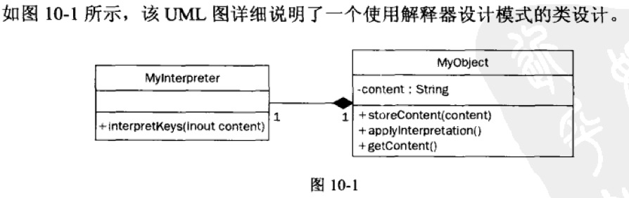

# 解释器模式_php

<!-- create time: 2016-10-09 20:48:18  -->

<!-- This file is created from $MARBOO_HOME/.media/starts/default.md
本文件由 $MARBOO_HOME/.media/starts/default.md 复制而来 -->

**名称 : 解释器**

    解释器设计模式用于分析一个实体的关键元素，并且针对每个元素都提供自己的解释或相应的动作。
    
**解释器设计模式** 最常用于 PHP/HTML 模板系统中。创建 HTML 文档时，其主体中使用了特定的占位符。占位符引用了处理对象、其他模板或文件系统中文件的函数或性能。

这些模板系统常用于处理类似数据的大型集合（例如用户配置文件）。

处理使用关键字此乃功能性的请求时，最好借助于一个使用解释器设计模式创建的对象。

> - `MyObject` 类处理器需要被解释的内容。它具有私有字符串 `content`，这个字符串存储需要处理的内容。
> - `storeContent()` 方法接受一个名为 `content` 的参数，该方法对处理内容进行预解释，随后将结果存储在 `MyObject` 对象内部。
> - 随后会调用 `applyInterpretation()` 方法。该方法会创建 `MyInterpreter` 类的一个实例。`MyInterpreter` 具有一个名为 `interpretKeys()` 的公共方法，这个方法接受参数 `content`。`applyInterpretation()` 并获取该参数的内部内容。`MyInterpreter` 类对要处理的内容执行解释，并且将结果返回 `MyObject`。接下来，`applyInterpretation()` 方法替换内部的内容变量。
> - 最后，`MyObject` 通过 `getContent()` 方法提供解释后的内容。
    
    class User
    {
        protected $_username = '';
    
        public function __construct($username) {
            $this->_username = $username;
        }
        public function getProfilePage() {
            //In lieu of getting the info from the DB, we mock here
            $profile = "<h2> I like Never Again! </h2>";
            $profile .= "I love all of their songs. My favorite CD:  ";
            $profile .= "{{myCD.getTitle}}!!";
    
            return $profile;
        }
    }
---
    class userCD
    {
        protected $_user = NULL;
        public function setUser($user) {
            $this->_user = $user;
        }
        public function getTitle() {
            //mock here
            $title = 'Waste of a Rib';
    
            return $title;
        }
    }
---
    class userCDInterpreter
    {
        protected $_user = NULL;
    
        public function setUser($user) {
            $this->_user = $user;
        }
        public function getInterpreted() {
            $profile = $this->_user->getProfilePage();
    
            if(preg_match_all('/\{\{\myCD\.(.*?)\}\}/', $profile,
                    $triggers, PREG_SET_ORDER)) {
                $replacements = array();
    
                foreach ($triggers as $trigger) {
                    $replacements[] = $trigger[1];
                }
    
                $replacements = array_unique($replacements);
    
                $myCD = new userCD();
                $myCD->setUser($this->_user);
    
                foreach ($replacements as $replacement) {
                    $profile = str_replace("{{myCD.{$replacement}}}",
                        call_user_func(array($myCD, $replacement)), $profile);
                }
            }
            return $profile;
        }
    }
