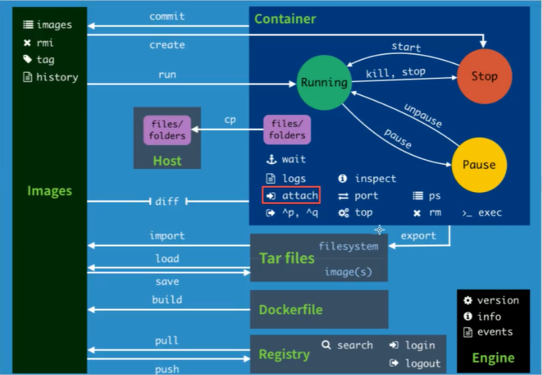

# Docker-学习

## 设置镜像仓库

```bash
#默认国外
https://download.docker.com/linux/centos/docker-ce.repo 
#推荐阿里云
http://mirrors.aliyun.com/docker-ce/linux/centos/docker-ce.repo

```

## 配置镜像加速器

国内从 DockerHub 拉取镜像有时会遇到困难，此时可以配置镜像加速器。Docker 官方和国内很多云服务商都提供了国内加速器服务，例如：

| 科大镜像     | https://docker.mirrors.ustc.edu.cn/  |
| ------------ | ------------------------------------ |
| 网易         | https://hub-mirror.c.163.com/        |
| 阿里云       | https://<你的ID>.mirror.aliyuncs.com |
| 七牛云加速器 | https://reg-mirror.qiniu.com         |

## 常用命令



### 镜像命令

```bash
# 查看镜像列表
# 只列出镜像id
docker images -aq 
docker images 
# 搜索镜像
docker search mysql
# 拉取镜像 docker pull mysql[:tag]
docker pull mysql
# 删除镜像
# docker rmi -f image_id
# docker rmi -f image_name
# docker rmi -f $(docker images -aq) 删除所有镜像
docker rmi -f feb5d9fea6a5
```

#### history

```bash
# 查看镜像构建记录
docker history image_id
```


### 容器命令

##### 新建容器并启动

```bash
docker run [或选参数] image

# 参数说明
--name="container_name"		#设定容器名字
-d						#后台运行
-it						#使用交互方式运行，进入容器查看内容
-p 						#指定容器的端口映射 -p 8080:8080
	-p ip:主机端口:容器端口
	-p 主机端口:容器端口
	-p 容器端口
-P 						#随机指定端口
-e 						# 参数配置

# 示例
docker run -it centos /bin/bash
# 后台运行
docker run -d centos

# 常见问题：
# docker 容器使用后台运行，容器中必须要有一个前台进程，docker 发现没有应用，就会自动停止。
```

##### 容器查看

```bash
docker ps [可选参数]

# 参数说明
-a 			# 显示全部容器
-n[=num] 	# 显示最近创建的容器
-q			# 只显示container_id

# 示例
docker ps -a
```

##### 交互条件下退出容器

```bash
exit	# 直接退出容器，容器停止
Ctrl + P + Q 	# 容器不停止退出
```

##### 容器的进入

```bash
# 进入正在运行的容器
docker exec -it container_id bashShell

# 进入容器正在执行的终端
docker attach container_id

# docker attach : 进入容器正在运行的终端，不启动新进程
# docker exec : 进入容器，并创建新会话
```

##### 从容器中复制文件到主机

```bash
docker cp container_id:/source_file_path target_path
```

##### 删除容器

```bash
# 只能删除停止状态的容器
docker rm 容器ID
# 删除所有容器 
docker rm -f $(docker ps -aq)
docker ps -aq | xargs docker rm
```

##### 启动与停止容器的操作

```bash
docker start container_id
docker restart container_id
docker stop container_id
docker kill container_id	
```

##### 日志查看

```bash
docker logs -f -t --tail container_id #查看容器日志-持续输出
docker logs -tf --tail 10 container_id #查看容器最近日志
```

##### 查看容器中的进程

```bash
docker top container_id
```

##### 容器-资源状态

```bash
docker stats
```

##### 查看容器的元数据

```bash
docker inspect container_id
```

### 帮助命令

```bash
docker version			# 显示docker的版本信息
docker info 			# 显示docker的系统信息，包括镜像和容器的数量
docker command --help	# 帮助命令
```


### 网络命令

##### 容器打包为镜像

```bash
# 提交容器为镜像
docker commit -a="author" -m="message" container_id image_name:tag
# 发布镜像到镜像库
docker push image_name:tag
```

##### 网络列表

```bash
docker network [command]

# 参数
connect 	# 链接容器到网络
disconnect	# 将一个容器从某一网络断开
inspect 	# 展示一个或多个网络的详细信息
ls 			# 网络列表

# 示例
docker network create -d bridge test-net	# 创建一个新的docker网络
docker run -itd --name test1 --network test-net ubuntu /bin/bash	# 将test1链接到test-net网络
docker run -itd --name test2 --network test-net ubuntu /bin/bash	# 将test2也链接到test-net网络
# 现在test1可以也test2容器通信
test1 > ping test2	# OK
test2 > ping test1	# OK
```

##### 设置DNS

```bash
docker run -it --rm -h host_ubuntu  --dns=114.114.114.114 --dns-search=example.com ubuntu

# 参数说明：
--rm				# 容器退出时自动清理容器内部的文件系统。
-h HOSTNAME
-hostname=HOSTNAME 	# 设定容器的主机名，它会被写到容器内的 /etc/hostname 和 /etc/hosts。
--dns=IP_ADDRESS	# 添加 DNS 服务器到容器的 /etc/resolv.conf 中，让容器用这个服务器来解析所有不在 /etc/hosts 中的主机名。
--dns-search=DOMAIN	# 设定容器的搜索域，当设定搜索域为 .example.com 时，在搜索一个名为 host 的主机时，DNS 不仅搜索 host，还会搜索 host.example.com。

#* 如果在容器启动时没有指定 --dns 和 --dns-search，Docker 会默认用宿主主机上的 /etc/resolv.conf 来配置容器的 DNS。
```


### 容器数据卷

##### 卷挂载

```bash
docker run -v machine_dir:docker_dir
docker run -v docker_dir				# 卷自动挂载[匿名挂载]
docker run -v volume_name:/docker_dir	# 卷挂载[具名挂载]
# ro : readonly	只读，只能在宿主机改文件
# rw : read&write 读写
docker run -v machine_dir:docker_dir:ro
```

##### 卷管理

```bash
docker volume [command]
# 参数
create 	# 创建卷
inspect	# 展示一个或多个卷信息
ls		# 卷列表
prune	# 移除所有未使用的本地卷
rm		# 移除一个或多个卷

# 示例
docker volume ls	# 查看所有卷
# 不同容器使用同一套卷管理方案
docker run --name docker02 --volumes-from docker01 docker_image_name:tag_name # 容器继承数据卷
# * docker01容器删除后，docker02仍然可以继续使用之前的数据卷策略
```

## dockerFile

### 构建镜像

```bash
docker build -t image_name:tag_name -f dock_file .
# 参数
-f 	# dockFile位置
-t	# 构建名称与版本
.	# 上下文路径，是指 docker 在构建镜像，有时候想要使用到本机的文件（比如复制），docker build 命令得知这个路径后，会将路径下的所有内容打包。

# *由于 docker 的运行模式是 C/S。我们本机是 C，docker 引擎是 S。实际的构建过程是在 docker 引擎下完成的，所以这个时候无法用到我们本机的文件。这就需要把我们本机的指定目录下的文件一起打包提供给 docker 引擎使用。
```


### 指令详解

#### FROM

定制的镜像都是基于 FROM 的镜像，这里的 nginx 就是定制需要的基础镜像。后续的操作都是基于 nginx。

#### MAINTAINER

镜像开发人员，姓名+邮箱

#### RUN

用于执行后面跟着的命令行命令，在执行 docker build 时执行。

```bash
RUN <命令行命令>
# <命令行命令> 等同于，在终端操作的 shell 命令。

# 示例
RUN ./test.php dev offline
```

#### CMD

类似于 RUN 指令，用于运行程序，但二者运行的时间点不同:

- CMD 在docker run 时运行。
- RUN 是在 docker build。

**作用**：为启动的容器指定默认要运行的程序，程序运行结束，容器也就结束。CMD 指令指定的程序可被 docker run 命令行参数中指定要运行的程序所覆盖。

**注意**：如果 Dockerfile 中如果存在多个 CMD 指令，**仅最后一个生效**。

格式：

```
CMD <shell 命令> 
CMD ["<可执行文件或命令>","<param1>","<param2>",...] 
CMD ["<param1>","<param2>",...]  # 该写法是为 ENTRYPOINT 指令指定的程序提供默认参数
```

推荐使用第二种格式，执行过程比较明确。第一种格式实际上在运行的过程中也会自动转换成第二种格式运行，并且默认可执行文件是 sh。

#### ENTRYPOINT

类似于 CMD 指令，但其不会被 docker run 的命令行参数指定的指令所覆盖，而且这些命令行参数会被当作参数送给 ENTRYPOINT 指令指定的程序。

但是, 如果运行 docker run 时使用了 --entrypoint 选项，将覆盖 CMD 指令指定的程序。

**优点**：在执行 docker run 的时候可以指定 ENTRYPOINT 运行所需的参数。

**注意**：如果 Dockerfile 中如果存在多个 ENTRYPOINT 指令，**仅最后一个生效**。

格式：

```bash
ENTRYPOINT ["<executeable>","<param1>","<param2>",...]
```

可以搭配 CMD 命令使用：一般是变参才会使用 CMD ，这里的 CMD 等于是在给 ENTRYPOINT 传参，以下示例会提到。

示例：

假设已通过 Dockerfile 构建了 nginx:test 镜像：

```bash
FROM nginx

ENTRYPOINT ["nginx", "-c"] # 定参
CMD ["/etc/nginx/nginx.conf"] # 变参 
```

1、不传参运行

```
$ docker run  nginx:test
```

容器内会默认运行以下命令，启动主进程。

```bash
nginx -c /etc/nginx/nginx.conf
```

2、传参运行

```bash
$ docker run  nginx:test -c /etc/nginx/new.conf
```

容器内会默认运行以下命令，启动主进程(/etc/nginx/new.conf:假设容器内已有此文件)

```bash
nginx -c /etc/nginx/new.conf
```

#### COPY

复制指令，从上下文目录中复制文件或者目录到容器里指定路径。

```bash
[--chown=<user>:<group>]	# 可选参数，用户改变复制到容器内文件的拥有者和属组

COPY [--chown=<user>:<group>] <源路径1>...  <目标路径>
COPY [--chown=<user>:<group>] ["<源路径1>",...  "<目标路径>"]

# 示例
COPY hom* /mydir/
COPY hom?.txt /mydir/
```

#### Add

ADD 指令和 COPY 的使用格类似（同样需求下，官方推荐使用 COPY）。功能也类似，不同之处如下：

- ADD 的优点：在执行 <源文件> 为 tar 压缩文件的话，压缩格式为 gzip, bzip2 以及 xz 的情况下，会自动复制并解压到 <目标路径>。
- ADD 的缺点：在不解压的前提下，无法复制 tar 压缩文件。会令镜像构建缓存失效，从而可能会令镜像构建变得比较缓慢。具体是否使用，可以根据是否需要自动解压来决定。


#### WORKDIR

指定工作目录。用 WORKDIR 指定的工作目录，会在构建镜像的每一层中都存在。（WORKDIR 指定的工作目录，必须是提前创建好的）。

docker build 构建镜像过程中的，每一个 RUN 命令都是新建的一层。只有通过 WORKDIR 创建的目录才会一直存在。

格式：

```bash
WORKDIR <工作目录路径>
```

#### VOLUME

定义匿名数据卷。在启动容器时忘记挂载数据卷，会自动挂载到匿名卷。

作用：

- 避免重要的数据，因容器重启而丢失，这是非常致命的。
- 避免容器不断变大。

格式：

```bash
VOLUME ["<路径1>", "<路径2>"...]
VOLUME <路径>
```

在启动容器 docker run 的时候，我们可以通过 -v 参数修改挂载点。

#### EXPOSE

仅仅只是声明端口。

作用：

- 帮助镜像使用者理解这个镜像服务的守护端口，以方便配置映射。
- 在运行时使用随机端口映射时，也就是 docker run -P 时，会自动随机映射 EXPOSE 的端口。

格式：

```bash
EXPOSE <端口1> [<端口2>...]
```

#### ONBUILD

用于延迟构建命令的执行。简单的说，就是 Dockerfile 里用 ONBUILD 指定的命令，在本次构建镜像的过程中不会执行（假设镜像为 test-build）。当有新的 Dockerfile 使用了之前构建的镜像 FROM test-build ，这时执行新镜像的 Dockerfile 构建时候，会执行 test-build 的 Dockerfile 里的 ONBUILD 指定的命令。

格式：

```bash
ONBUILD <其它指令>
```

#### ENV

设置环境变量，定义了环境变量，那么在后续的指令中，就可以使用这个环境变量。

格式：

```bash
ENV <key> <value>
ENV <key1>=<value1> <key2>=<value2>...
```

以下示例设置 NODE_VERSION = 7.2.0 ， 在后续的指令中可以通过 $NODE_VERSION 引用：

```bash
ENV NODE_VERSION 7.2.0

RUN curl -SLO "https://nodejs.org/dist/v$NODE_VERSION/node-v$NODE_VERSION-linux-x64.tar.xz" \
  && curl -SLO "https://nodejs.org/dist/v$NODE_VERSION/SHASUMS256.txt.asc"
```

#### ARG

构建参数，与 ENV 作用一致。不过作用域不一样。ARG 设置的环境变量仅对 Dockerfile 内有效，也就是说只有 docker build 的过程中有效，构建好的镜像内不存在此环境变量。

构建命令 docker build 中可以用 --build-arg <参数名>=<值> 来覆盖。

格式：

```bash
ARG <参数名>[=<默认值>]
```

#### LABEL

LABEL 指令用来给镜像添加一些元数据（metadata），以键值对的形式，语法格式如下：

```bash
LABEL <key>=<value> <key>=<value> <key>=<value> ...
```

比如我们可以添加镜像的作者：

```bash
LABEL org.opencontainers.image.authors="runoob"
```


## Docker Composer

#### Compose 简介

Compose 是用于定义和运行多容器 Docker 应用程序的工具。通过 Compose，您可以使用 YML 文件来配置应用程序需要的所有服务。然后，使用一个命令，就可以从 YML 文件配置中创建并启动所有服务。

**Compose 使用的三个步骤**：

- 使用 Dockerfile 定义应用程序的环境。
- 使用 docker-compose.yml 定义构成应用程序的服务，这样它们可以在隔离环境中一起运行。
- 最后，执行 docker-compose up 命令来启动并运行整个应用程序。


