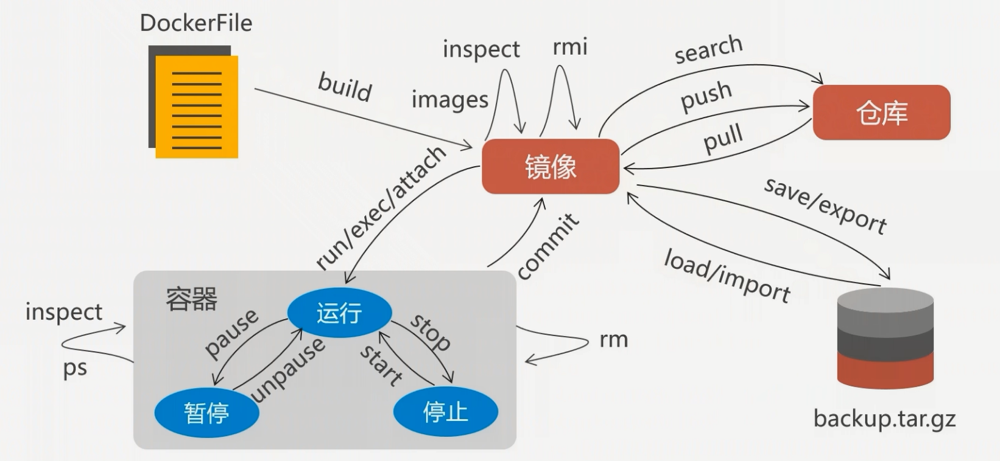

# docker 操作小结

## Docker 容器管理



####  在容器内运行一个应用程序
```bash
docker run ubuntu:15.10 /bin/echo "hello world"
# docker run 镜像:版本 命令 参数
# Docker首先从本地主机上查找镜像是否存在，如果不存在，Docker 就会从镜像仓库 Docker Hub 下载公共镜像。
```

#### 启动容器（后台模式）
```bash
# 使用以下命令创建一个以进程方式运行的容器
$ docker run -d ubuntu:15.10 /bin/sh -c "while true; do echo hello world; sleep 1; done"
> 2b1b7a428627c51ab8810d541d759f072b4fc75487eed05812646b8534a2fe63
# 在输出中，我们没有看到期望的"hello world"，而是一串长字符
#2b1b7a428627c51ab8810d541d759f072b4fc75487eed05812646b8534a2fe63
# 这个长字符串叫做容器ID，对每个容器来说都是唯一的，
# CONTAINER ID:容器ID [2b1b7a428627]
```

#### 容器命名
当我们创建一个容器的时候，docker 会自动对它进行命名。另外，我们也可以使用 --name 标识来命名容器，例如：
```bash
$  docker run -d -P --name runoob training/webapp python app.py
```

#### 容器交互

##### 容器创建并交互
```bash
$ docker run -i -t ubuntu:15.10 /bin/bash
# -t:在新容器内指定一个伪终端或终端。
# -i:允许你对容器内的标准输入 (STDIN) 进行交互。
```

##### 与正在运行的容器交互
```bash
$ docker exec -it 90f93f98a23d /bin/bash
```

#### 查看容器内的标准输出
```bash
# 在容器内使用docker logs命令，查看容器内的标准输出
# CONTAINER ID:容器ID [2b1b7a428627]
# NAMES:自动分配的容器名称 [amazing_cori]
$ docker logs 2b1b7a428627
$ docker logs amazing_cori
```

#### 停止容器
```bash
# docker stop 命令来停止容器: 
# CONTAINER ID:容器ID [2b1b7a428627]
# NAMES:自动分配的容器名称 [amazing_cori]
$ docker stop 2b1b7a428627
$ docker stop amazing_cori
```

#### 重启WEB应用容器
```bash
# 已经停止的容器，我们可以使用命令 docker start 来启动。
$ docker start amazing_cori
```

#### 移除WEB应用容器
我们可以使用 docker rm 命令来删除不需要的容器
删除容器时，容器必须是停止状态
```bash
$ docker rm wizardly_chandrasekhar 
> wizardly_chandrasekhar
$ docker rm $(docker ps -a -p)	#删除所有容器
```

#### 检查 WEB 应用程序(查看 Docker 的底层信息)
```bash
# 使用 docker inspect 来查看 Docker 的底层信息。它会返回一个 JSON 文件记录着 Docker 容器的配置和状态信息。
$ docker inspect wizardly_chandrasekhar
```

#### 查看WEB应用程序容器的进程
```bash
# 可以使用 docker top 来查看容器内部运行的进程
$ docker top wizardly_chandrasekhar
```

#### 查看 WEB 应用容器
```bash
# 使用 docker ps 来查看我们正在运行的容器：
$ docker ps
```
##### 查询最后一次创建的容器：
```bash
$  docker ps -l 
```
##### 查询所有容器：
```bash
$  docker ps -a
```

________________


## Docker 镜像管理 

#### 列出本地主机上镜像
```bash
docker images
```

#### 查找镜像
我们可以从 Docker Hub 网站来搜索镜像，Docker Hub 网址为： https://hub.docker.com/
我们也可以使用 docker search 命令来搜索镜像。
```bash
# 比如我们需要一个httpd的镜像来作为我们的web服务。
$  docker search httpd
```

### 创建镜像
当我们从docker镜像仓库中下载的镜像不能满足我们的需求时，我们可以通过以下两种方式对镜像进行更改。
>1. 从已经创建的容器中更新镜像，并且提交这个镜像
>2. 使用 Dockerfile 指令来创建一个新的镜像
##### 更新镜像
可以通过命令 docker commit来提交容器副本。
```bash
$ docker commit -m="has update" -a="runoob" e218edb10161 runoob/ubuntu:v2
> sha256:70bf1840fd7c0d2d8ef0a42a817eb29f854c1af8f7c59fc03ac7bdee9545aff8
# -m:提交的描述信息
# -a:指定镜像作者
# e218edb10161：容器ID
# runoob/ubuntu:v2:指定要创建的目标镜像名
```

##### 构建镜像
我们使用命令 docker build ， 从零开始来创建一个新的镜像。为此，我们需要创建一个 Dockerfile 文件，其中包含一组指令来告诉 Docker 如何构建我们的镜像。
```bash
$ cat Dockerfile 
FROM    centos:6.7
MAINTAINER      Fisher "fisher@sudops.com"

RUN     /bin/echo 'root:123456' |chpasswd
RUN     useradd runoob
RUN     /bin/echo 'runoob:123456' |chpasswd
RUN     /bin/echo -e "LANG=\"en_US.UTF-8\"" >/etc/default/local
EXPOSE  22
EXPOSE  80
CMD     /usr/sbin/sshd -D
```
每一个指令都会在镜像上创建一个新的层，每一个指令的前缀都必须是大写的。
第一条FROM，指定使用哪个镜像源
RUN 指令告诉docker 在镜像内执行命令，安装了什么。。。
然后，我们使用 Dockerfile 文件，通过 docker build 命令来构建一个镜像。
```bash
$ docker build -t runoob/centos:6.7 .
# -t ：指定要创建的目标镜像名
# . ：Dockerfile 文件所在目录，可以指定Dockerfile 的绝对路径
```

#### 设置镜像标签
可以使用 docker tag 命令，为镜像添加一个新的标签。
```bash
$ docker tag 860c279d2fec runoob/centos:dev
```
docker tag 镜像ID，这里是 860c279d2fec ,用户名称、镜像源名(repository name)和新的标签名(tag)。
使用 docker images 命令可以看到，ID为860c279d2fec的镜像多一个标签。

___________


## Docker 容器连接

##### 网络端口映射
```bash
$ docker run -d -P training/webapp python app.py
# -d:让容器在后台运行。
# -P:将容器内部使用的网络端口映射到我们使用的主机上。
$ docker run -d -p 5000:5000 training/webapp python app.py
# -p : 是容器内部端口绑定到指定的主机端口。
```
```bash
# 通过 docker ps 命令可以查看到容器的端口映射，docker 还提供了另一个快捷方式 docker port，使用 docker port 可以查看指定 （ID 或者名字）容器的某个确定端口映射到宿主机的端口号。
$ docker port bf08b7f2cd89
$ docker port wizardly_chandrasekhar
```

#### 绑定网络地址
```bash
# 比如绑定 127.0.0.1。
$ docker run -d -p 127.0.0.1:5001:5000 training/webapp python app.py
> 95c6ceef88ca3e71eaf303c2833fd6701d8d1b2572b5613b5a932dfdfe8a857c
```

#### 绑定网络协议
```bash
# 默认都是绑定 tcp 端口，如果要绑定 UDP 端口，可以在端口后面加上 /udp。
$ docker run -d -p 127.0.0.1:5000:5000/udp training/webapp python app.py
> 95c6ceef88ca3e71eaf303c2833fd6701d8d1b2572b5613b5a932dfdfe8a857c
```

#### 目录共享
```bash
$ docker run -p 80:80 --name mynginx -v /var/www:/www -v /etc/conf/nginx.conf:/etc/nginx/nginx.conf -v /var/logs:/wwwlogs -d nginx 
#    -p 80:80：将容器的80端口映射到主机的80端口
#    --name mynginx：将容器命名为mynginx
#    -v $PWD/www:/www：将主机中当前目录下的www挂载到容器的/www
#    -v $PWD/conf/nginx.conf:/etc/nginx/nginx.conf：将主机中当前目录下的nginx.conf挂载到容器的/etc/nginx/nginx.conf
#    -v $PWD/logs:/wwwlogs：将主机中当前目录下的logs挂载到容器的/wwwlogs
```