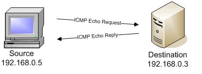
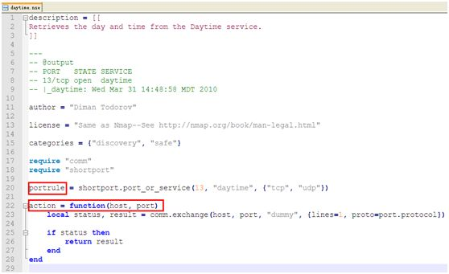

# Nmap商品扫描


Nmap可以完成以下任务：

> - 主机发现（Host Discovery）
> - 端口扫描（Port Scanning）
> - 版本侦测（Version Detection）
> - 操作系统侦测（Operating System Detection）
> - 支持探测脚本的编写

端口扫描工具，即借助工具，试图了解所扫描IP提供的计算机网络服务类型（网络服务均与端口号相关），从而发现攻击弱点。

##### 确定目标主机在线情况及端口基本状况

```bash
nmap targetHost
```

##### 完整全面的扫描

```bash
nmap –T4 –A –v targetHost
```

>1. -T4指定扫描过程使用的时序（Timing），总有6个级别（0-5），级别越高，扫描速度越快，但也容易被防火墙或IDS检测并屏蔽掉，在网络通讯状况良好的情况推荐使用T4；
>2. 在未指定扫描端口时，Nmap默认扫描1000个最有可能开放的端口。

### 主机发现

主机发现（Host Discovery），即用于发现目标主机是否在线（Alive，处于开启状态）。

#### 1. 主机发现原理

主机发现发现的原理与Ping命令类似，发送探测包到目标主机，如果收到回复，那么说明目标主机是开启的。Nmap支持十多种不同的主机探测方式，比如发送`ICMP ECHO`/`TIMESTAMP`/`NETMASK`报文、发送`TCPSYN/ACK`包、发送`SCTP INIT`/`COOKIE-ECHO`包，用户可以在不同的条件下灵活选用不同的方式来探测目标机。

主机发现基本原理：（以`ICMP echo`方式为例）



如果该请求报文没有被防火墙拦截掉，那么目标机会回复ICMP Echo Reply包回来。以此来确定目标主机是否在线。

默认情况下，Nmap会发送四种不同类型的数据包来探测目标主机是否在线。
> 1.  ICMP echo request
> 2.  a TCP SYN packet to port 443
> 3.  a TCP ACK packet to port 80
> 4.  an ICMP timestamp request

依次发送四个报文探测目标机是否开启。只要收到其中一个包的回复，那就证明目标机开启。使用四种不同类型的数据包可以避免因防火墙或丢包造成的判断错误。

#### 2. 主机发现的用法
通常主机发现并不单独使用，而只是作为端口扫描、版本侦测、OS侦测先行步骤。而在某些特殊应用（例如确定大型局域网内活动主机的数量），可能会单独专门适用主机发现功能来完成。

不管是作为辅助用法还是专门用途，用户都可以使用Nmap提供的丰富的选项来定制主机发现的探测方式。
>`-sL`        : List Scan 列表扫描，仅将指定的目标的IP列举出来，不进行主机发现。
>`-sn`        : Ping Scan 只进行主机发现，不进行端口扫描。
>`-Pn`        : 将所有指定的主机视作开启的，跳过主机发现的过程。
>`-PS/PA/PU/PY[portlist]`       : 使用TCPSYN/ACK或SCTP INIT/ECHO方式进行发现。
>`-PE/PP/PM`  		: 使用ICMP echo, timestamp, and netmask 请求包发现主机。
>`-PO[protocollist]`            : 使用IP协议包探测对方主机是否开启。
>`-n/-R`      		: -n表示不进行DNS解析；-R表示总是进行DNS解析。
>`--dns-servers <serv1[,serv2],...>`	: 指定DNS服务器。
>`--system-dns` 	: 指定使用系统的DNS服务器
>`--traceroute`    : 追踪每个路由节点

其中，比较常用的使用的是`-sn`，表示只单独进行主机发现过程；`-Pn`表示直接跳过主机发现而进行端口扫描等高级操作（如果已经确知目标主机已经开启，可用该选项）；`-n`，如果不想使用DNS或reverse DNS解析，那么可以使用该选项。

#### 3. 使用演示

**探测 scanme.nmap.org 主机**

```bash
nmap –sn –PE –PS80,135 –PU53 scanme.nmap.org
```
命令向 scanme.nmap.org 的IP地址182.140.147.57发送了四个探测包：ICMPEcho，80和135端口的TCP SYN包，53端口的UDP包（DNS domain）。

**探测局域网内活动主机**

```bash
nmap –sn 192.168.1.100-120
```

Nmap是通过ARP包来询问IP地址上的主机是否活动的，如果收到ARP回复包，那么说明主机在线。

### 端口扫描

端口扫描是Nmap最基本最核心的功能，用于确定目标主机的TCP/UDP端口的开放情况。
默认情况下，Nmap会扫描1000个最有可能开放的TCP端口。
Nmap通过探测将端口划分为6个状态：

>`open`   ：端口是开放的。
>`closed`   ：端口是关闭的。
>`filtered`   ：端口被防火墙IDS/IPS屏蔽，无法确定其状态。
>`unfiltered`   ：端口没有被屏蔽，但是否开放需要进一步确定。
>`open|filtered`   ：端口是开放的或被屏蔽。
>`closed|filtered`   ：端口是关闭的或被屏蔽。

#### 1. 端口扫描用法

端口扫描用法比较简单，Nmap提供丰富的命令行参数来指定扫描方式和扫描端口。

**扫描方式选项**

> `-sS/sT/sA/sW/sM`   :指定使用 TCP SYN/Connect()/ACK/Window/Maimon scans的方式来对目标主机进行扫描。 
> `-sU`   : 指定使用UDP扫描方式确定目标主机的UDP端口状况。 
> `-sN/sF/sX`   : 指定使用TCP Null, FIN, and Xmas scans秘密扫描方式来协助探测对方的TCP端口状态。 
> `--scanflags <flags>`   : 定制TCP包的flags。 
> `-sI <zombiehost[:probeport]>`   : 指定使用idle scan方式来扫描目标主机（前提需要找到合适的zombie host） 
> `-sY/sZ`   : 使用SCTP INIT/COOKIE-ECHO来扫描SCTP协议端口的开放的情况。 
> `-sO`   : 使用IP protocol 扫描确定目标机支持的协议类型。 
> `-b <FTP relay host>`   : 使用FTP bounce scan扫描方式

**端口参数与扫描顺序**

>`-p <port ranges>`   : 扫描指定的端口 
>实例: -p22; -p1-65535; -p U:53,111,137,T:21-25,80,139,8080,S:9（其中T代表TCP协议、U代表UDP协议、S代表SCTP协议） 
>`-F`   : Fast mode – 快速模式，仅扫描TOP 100的端口 
>`-r`   : 不进行端口随机打乱的操作（如无该参数，nmap会将要扫描的端口以随机顺序方式扫描，以让nmap的扫描不易被对方防火墙检测到）。 
>`--top-ports <number>`   :扫描开放概率最高的number个端口（nmap的作者曾经做过大规模地互联网扫描，以此统计出网络上各种端口可能开放的概率。以此排列出最有可能开放端口的列表，具体可以参见文件：nmap-services。默认情况下，nmap会扫描最有可能的1000个TCP端口） 
>`--port-ratio <ratio>`   : 扫描指定频率以上的端口。与上述--top-ports类似，这里以概率作为参数，让概率大于--port-ratio的端口才被扫描。显然参数必须在在0到1之间，具体范围概率情况可以查看nmap-services文件。

#### 2. 端口扫描演示

```bash
nmap –sS –sU –T4 –top-ports 300 192.168.1.100
```

参数`-sS`表示使用TCP SYN方式扫描TCP端口；`-sU`表示扫描UDP端口；`-T4`表示时间级别配置4级；`--top-ports 300`表示扫描最有可能开放的300个端口（TCP和UDP分别有300个端口）。

### 版本侦测

版本侦测，用于确定目标主机开放端口上运行的具体的应用程序及版本信息。

Nmap提供的版本侦测具有如下的优点：

>高速。  并行地进行套接字操作，实现一组高效的探测匹配定义语法。
>尽可能地确定应用名字与版本名字。
>支持TCP/UDP协议，支持文本格式与二进制格式。
>支持多种平台服务的侦测，包括Linux/Windows/Mac OS/FreeBSD等系统。
>如果检测到SSL，会调用openSSL继续侦测运行在SSL上的具体协议（如HTTPS/POP3S/IMAPS）。
>如果检测到SunRPC服务，那么会调用brute-force RPC grinder进一步确定RPC程序编号、名字、版本号。
>支持完整的IPv6功能，包括TCP/UDP，基于TCP的SSL。
>通用平台枚举功能（CPE）
>广泛的应用程序数据库（nmap-services-probes）。目前Nmap可以识别几千种服务的签名，包含了180多种不同的协议。

#### 1. 版本侦测原理

版本侦测主要分为以下几个步骤：

> 1. 首先检查open与open|filtered状态的端口是否在排除端口列表内。如果在排除列表，将该端口剔除。
> 2. 如果是TCP端口，尝试建立TCP连接。尝试等待片刻（通常6秒或更多，具体时间可以查询文件nmap-services-probes中Probe TCP NULL q||对应的totalwaitms）。通常在等待时间内，会接收到目标机发送的“WelcomeBanner”信息。nmap将接收到的Banner与nmap-services-probes中NULL probe中的签名进行对比。查找对应应用程序的名字与版本信息。
> 3. 如果通过“Welcome Banner”无法确定应用程序版本，那么nmap再尝试发送其他的探测包（即从nmap-services-probes中挑选合适的probe），将probe得到回复包与数据库中的签名进行对比。如果反复探测都无法得出具体应用，那么打印出应用返回报文，让用户自行进一步判定。
> 4. 如果是UDP端口，那么直接使用nmap-services-probes中探测包进行探测匹配。根据结果对比分析出UDP应用服务类型。
> 5. 如果探测到应用程序是SSL，那么调用openSSL进一步的侦查运行在SSL之上的具体的应用类型。
> 6. 如果探测到应用程序是SunRPC，那么调用brute-force RPC grinder进一步探测具体服务。


#### 2. 版本侦测的用法

版本侦测方面的命令行选项比较简单。

>`-sV`   : 指定让Nmap进行版本侦测
>`--version-intensity <level>`   : 指定版本侦测强度（0-9），默认为7。数值越高，探测出的服务越准确，但是运行时间会比较长。
>`--version-light`   : 指定使用轻量侦测方式 (intensity 2)
>`--version-all`   : 尝试使用所有的probes进行侦测 (intensity 9)
>`--version-trace`   : 显示出详细的版本侦测过程信息。

#### 3. 版本侦测演示

```bash
nmap –sV 192.168.1.100
```

对主机192.168.1.100进行版本侦测。

### OS侦测

操作系统侦测用于检测目标主机运行的操作系统类型及设备类型等信息。

Nmap拥有丰富的系统数据库nmap-os-db，目前可以识别2600多种操作系统与设备类型。

#### 1. OS侦测原理

Nmap使用TCP/IP协议栈指纹来识别不同的操作系统和设备。在RFC规范中，有些地方对TCP/IP的实现并没有强制规定，由此不同的TCP/IP方案中可能都有自己的特定方式。Nmap主要是根据这些细节上的差异来判断操作系统的类型的。

具体实现方式如下：

>1. Nmap内部包含了2600多已知系统的指纹特征（在文件nmap-os-db文件中）。将此指纹数据库作为进行指纹对比的样本库。
>2. 分别挑选一个open和closed的端口，向其发送经过精心设计的TCP/UDP/ICMP数据包，根据返回的数据包生成一份系统指纹。
>3. 将探测生成的指纹与nmap-os-db中指纹进行对比，查找匹配的系统。如果无法匹配，以概率形式列举出可能的系统。

#### 2. OS侦测用法

OS侦测的用法简单，Nmap提供的命令比较少。

> -O: 指定Nmap进行OS侦测。
> --osscan-limit: 限制Nmap只对确定的主机的进行OS探测（至少需确知该主机分别有一个open和closed的端口）。
> --osscan-guess: 大胆猜测对方的主机的系统类型。由此准确性会下降不少，但会尽可能多为用户提供潜在的操作系统。

#### 3. OS侦测演示

命令：

```bash
nmap –O 192.168.1.100
```


### Nmap高级用法

#### 防火墙/IDS规避

防火墙与IDS规避为用于绕开防火墙与IDS（入侵检测系统）的检测与屏蔽，以便能够更加详细地发现目标主机的状况。

Nmap提供了多种规避技巧，通常可以从两个方面考虑规避方式：数据包的变换（Packet Change）与时序变换（Timing Change）。

#### 1. 规避原理

**1. 分片（Fragmentation）**

将可疑的探测包进行分片处理（例如将TCP包拆分成多个IP包发送过去），某些简单的防火墙为了加快处理速度可能不会进行重组检查，以此避开其检查。

**2. IP诱骗（IP decoys）**

在进行扫描时，将真实IP地址和其他主机的IP地址（其他主机需要在线，否则目标主机将回复大量数据包到不存在的主机，从而实质构成了拒绝服务攻击）混合使用，以此让目标主机的防火墙或IDS追踪检查大量的不同IP地址的数据包，降低其追查到自身的概率。注意，某些高级的IDS系统通过统计分析仍然可以追踪出扫描者真实IP地址。

**3. IP伪装（IP Spoofing）**

顾名思义，IP伪装即将自己发送的数据包中的IP地址伪装成其他主机的地址，从而目标机认为是其他主机在与之通信。需要注意，如果希望接收到目标主机的回复包，那么伪装的IP需要位于统一局域网内。另外，如果既希望隐蔽自己的IP地址，又希望收到目标主机的回复包，那么可以尝试使用idle scan或匿名代理（如TOR）等网络技术。

**4. 指定源端口**

某些目标主机只允许来自特定端口的数据包通过防火墙。例如FTP服务器配置为：允许源端口为21号的TCP包通过防火墙与FTP服务端通信，但是源端口为其他端口的数据包被屏蔽。所以，在此类情况下，可以指定Nmap将发送的数据包的源端口都设置特定的端口。

**5. 扫描延时**

某些防火墙针对发送过于频繁的数据包会进行严格的侦查，而且某些系统限制错误报文产生的频率（例如，Solaris 系统通常会限制每秒钟只能产生一个ICMP消息回复给UDP扫描），所以，定制该情况下发包的频率和发包延时可以降低目标主机的审查强度、节省网络带宽。

**6. 其他技术**

Nmap还提供多种规避技巧，比如指定使用某个网络接口来发送数据包、指定发送包的最小长度、指定发包的MTU、指定TTL、指定伪装的MAC地址、使用错误检查和（badchecksum）。

更多信息:[http://nmap.org/book/man-bypass-firewalls-ids.html](http://nmap.org/book/man-bypass-firewalls-ids.html)

#### 2. 规避用法

> -f; --mtu <val>: 指定使用分片、指定数据包的MTU. 
> -D <decoy1,decoy2[,ME],...>: 用一组IP地址掩盖真实地址，其中ME填入自己的IP地址。 
> -S <IP_Address>: 伪装成其他IP地址 
> -e <iface>: 使用特定的网络接口 
> -g/--source-port <portnum>: 使用指定源端口 
> --data-length <num>: 填充随机数据让数据包长度达到Num。 
> --ip-options <options>: 使用指定的IP选项来发送数据包。 
> --ttl <val>: 设置time-to-live时间。 
> --spoof-mac <mac address/prefix/vendor name>: 伪装MAC地址 
> --badsum: 使用错误的checksum来发送数据包（正常情况下，该类数据包被抛弃，如果收到回复，说明回复来自防火墙或IDS/IPS）。

#### 3. 规避演示

使用命令：

```bash
nmap -v -F -Pn -D192.168.1.100,192.168.1.102,ME -e eth0 -g 3355 192.168.1.1
```

其中，-F表示快速扫描100个端口；-Pn表示不进行Ping扫描；-D表示使用IP诱骗方式掩盖自己真实IP（其中ME表示自己IP）；-e eth0表示使用eth0网卡发送该数据包；-g 3355表示自己的源端口使用3355；192.168.1.1是被扫描的目标IP地址。

## NSE脚本引擎

NSE脚本引擎（Nmap Scripting Engine）是Nmap最强大最灵活的功能之一，允许用户自己编写脚本来执行自动化的操作或者扩展Nmap的功能。

NSE使用Lua脚本语言，并且默认提供了丰富的脚本库，目前已经包含14个类别的350多个脚本。

NSE的设计初衷主要考虑以下几个方面：

1. 网络发现（Network Discovery）
2. 更加复杂的版本侦测（例如skype软件）
3. 漏洞侦测(Vulnerability Detection)
4. 后门侦测(Backdoor Detection)
5. 漏洞利用(Vulnerability Exploitation)

#### 1. NSE创建脚本方法



NSE的使用Lua脚本，并且配置固定格式，以减轻用户编程负担。通常的一个脚本分为几个部分：

> **description字段**：描述脚本功能的字符串，使用双层方括号表示。
> **comment字段**：以--开头的行，描述脚本输出格式
> **author字段**：描述脚本作者
> **license字段**：描述脚本使用许可证，通常配置为Nmap相同的license
> **categories字段**：描述脚本所属的类别，以对脚本的调用进行管理。
> **rule字段**：描述脚本执行的规则，也就是确定触发脚本执行的条件。在Nmap中有四种类型的规则，prerule用于在Nmap没有执行扫描之前触发脚本执行，这类脚本并不需用到任何Nmap扫描的结果；hostrule用在Nmap执行完毕主机发现后触发的脚本，根据主机发现的结果来触发该类脚本；portrule用于Nmap执行端口扫描或版本侦测时触发的脚本，例如检测到某个端口时触发某个脚本执行以完成更详细的侦查。postrule用于Nmap执行完毕所有的扫描后，通常用于扫描结果的数据提取和整理。在上述实例中，只有一个portrule，说明该脚本在执行端口扫描后，若检测到TCP 13号端口开放，那么触发该脚本的执行。
> **action字段**：脚本执行的具体内容。当脚本通过rule字段的检查被触发执行时，就会调用action字段定义的函数。


#### 2. NSE脚本用法

Nmap提供不少脚本使用的命令行参数。

>-sC: 等价于 --script=default，使用默认类别的脚本进行扫描。
>--script=<Lua scripts>: <Lua scripts>使用某个或某类脚本进行扫描，支持通配符描述
>--script-args=<n1=v1,[n2=v2,...]>: 为脚本提供默认参数
>--script-args-file=filename: 使用文件来为脚本提供参数
>--script-trace: 显示脚本执行过程中发送与接收的数据
>--script-updatedb: 更新脚本数据库
>--script-help=<Lua scripts>: 显示脚本的帮助信息，其中<Luascripts>部分可以逗号分隔的文件或脚本类别。

#### 3. NSE用法演示

配合脚本扫描192.168.1.1，查看能否获得有用的信息。

命令如下：

```bash
nmap –sV –p 80 –v –script default,http*192.168.1.1
```


常见服务对应端口号：

| 服务                                         | 端口号 |
| -------------------------------------------- | ------ |
| HTTP                                         | 80     |
| HTTPS                                        | 443    |
| Telnet                                       | 23     |
| FTP                                          | 21     |
| SSH（安全登录）、SCP（文件传输）、端口重定向 | 22     |
| SMTP                                         | 25     |
| POP3                                         | 110    |
| WebLogic                                     | 7001   |
| MySQL 数据库sever                            | 3306   |