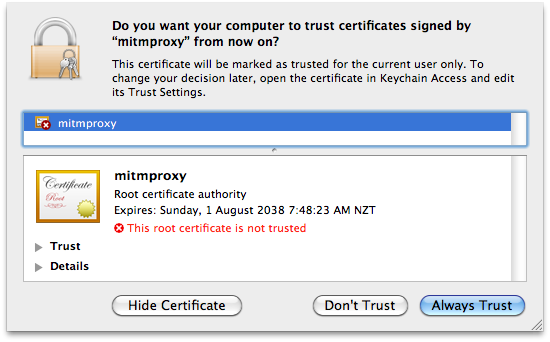
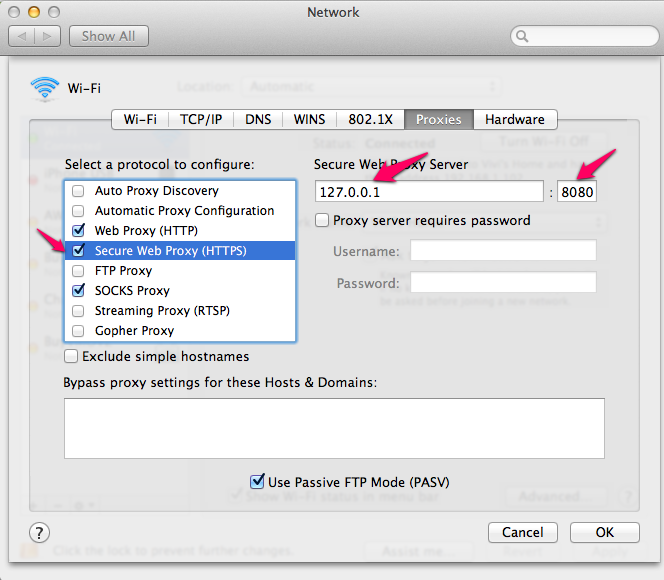

Mitmproxy
=========
[mitmproxy](http://mitmproxy.org) 全称是指Man-In-The-Middle Proxy


在MAC下我试用了一下，非常方便，不用在切换到win下抓包了。

官方安装如下：


```
$ pip install mitmproxy
```

```
$ pip install /path/to/source
```


证书默认都在~/.mitmproxy 目录中，双击 mitmproxy-ca-cert.pem 支持多系统[证书](./Mitmproxy/cert.md)导入按照下图提示：




接着如图设置HTTP/HTTPS代理。



OK，让我们熟悉一下如何使用吧。先测试一下抓HTTPS包。打开iterm输入`mitmproxy`


在看了下请求数据后，按 **`i`** 输入要中断的请求的关键字 `~u itunes`，在请求 URL 包含`itunes`字样时中断以进行人工编辑。打开itunes应用。切换iterm使用j键移动到停下来的橙色请求上：


按回车显示详细信息，tab键切换Request/Response  按e进行编辑，编辑完成后(vim保存退出:wq)退回到请求列表界面，按a继续，再按a接受响应信息。按q返回上一层。


常用命令 | 含义 |
--------|------|
j, k, h, l|上、下、左、右移动|
C| 清除列表、事件日志|
i| 设置拦截规则，支持正则(Python-Style)|
M| 切换全局默认显示模式|
q| 退出、返回列表|


拦截规则 | 含义 |
--------|------|
~m|拦截所有的POST request [~m POST]（m代表method）|
~h|拦截特定的header|
~d|拦截特定的domain|
~c|拦截特定的响应代码（404之类的）|
~q|拦截所有的request|


** 更多命令?查看，按q退回。**

它本身还提供了一个可供用户调用的库[libmproxy](./Mitmproxy/libmproxy.md)来定制自己的工具，还提供了改进版的tcpdump—mitmdump。


