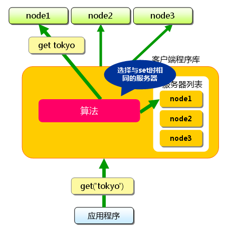

# Memcached_分布式方法

<!-- create time: 2016-03-17 17:13:39  -->

<!-- This file is created from $MARBOO_HOME/.media/starts/default.md
本文件由 $MARBOO_HOME/.media/starts/default.md 复制而来 -->

`memcached`的分布式，则是完全由客户端程序库实现的。 这种分布式是`memcached`的最大特点。  
由于`memcached`服务器几乎不占用CPU，就将换下来的服务器用作`memcached`服务器了。

首先向`memcached`中添加“tokyo”。将“tokyo”传给客户端程序库后， 客户端实现的算法就会根据“键”来决定保存数据的`memcached`服务器。 服务器选定后，即命令它保存“tokyo”及其值。

这样，将不同的键保存到不同的服务器上，就实现了`memcached`的分布式。 `memcached`服务器增多后，键就会分散，即使一台`memcached`服务器发生故障 无法连接，也不会影响其他的缓存，系统依然能继续运行。

### 根据余数计算分散的优点与缺点

余数计算的方法简单，数据的分散性也相当优秀，但也有其缺点。 那就是当添加或移除服务器时，缓存重组的代价相当巨大。 添加(移除)服务器后，余数就会产生巨变。。在Web应用程序中使用`memcached`时， 在添加`memcached`服务器的瞬间缓存效率会大幅度下降，负载会集中到数据库服务器上， 有可能会发生无法提供正常服务的情况。

### 新的分布式算法::Consistent Hashing

**Consistent Hashing的简单说明**

`Consistent Hashing`如下所示：首先求出memcached服务器（节点）的哈希值， 并将其配置到`0～232`的圆（continuum）上。 然后用同样的方法求出存储数据的键的哈希值，并映射到圆上。 然后从数据映射到的位置开始顺时针查找，将数据保存到找到的第一个服务器上。 如果超过232仍然找不到服务器，就会保存到第一台`memcached`服务器上。

下图为添加node5服务器效果 : 

通过下文中介绍的使用`Consistent Hashing`算法的`memcached`客户端函数库进行测试的结果是， 由服务器台数（`n`）和增加的服务器台数（`m`）计算增加服务器后的命中率计算公式如下：

    (1 - n/(n+m)) * 100
