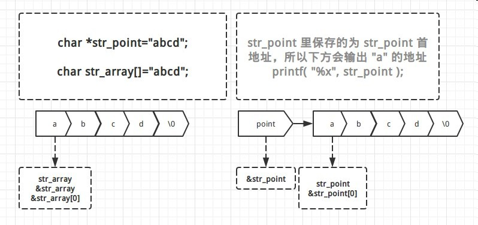

C_字符数组与字符串指针

##1. 字符数组为首地址， 字符指针为指针

测试代码 :

     char * str_point="abcd";
     char str_array[]="abcd";

     printf( "%x\n", str_point );
     printf( "%x\n", &str_point );
     printf( "%x\n", &str_point[0] );

     printf( "%x\n", str_array );
     printf( "%x\n", &str_array );
     printf( "%x\n", &str_array[0] );

输出 :

	400b00
	8f47b3f8
	400b00
	8f47b3f0
	8f47b3f0
	8f47b3f0

str_array 保存的是字符串常量的首地址，而 str_array 本身地址和指向的地址是统一的;

str_point 保存的是字符串常量的地址，但 str_point 只是一个第三方的指针变量，str_point 地址与指向的地址并不相同。

具体如下图 :

2. 输出字符指针指向的值

字符指针，只能输出字符串，不能输出字符，除非前面加 *

测试代码 :

	char *str_point="abcd";
	printf( "%s", str_point );
	printf( "%c", str_point );
	printf( "%c", *str_point );
	printf( "%c", str_point[0] );

输出 :

	abcd
	X	//未知字符,不同的机子不同的时间的运行结果可能会不一样，因为地址可能会发生变化
	a
	a

3. 初始化字符串，字符数组之间的常量关系
http://www.cnblogs.com/KingOfFreedom/archive/2012/12/07/2807223.html

