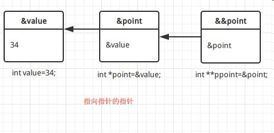

C_指针与函数3

## 指向指针的指针

指向指针的指针是一种多级间接寻址的形式，或者说是一个指针链。通常，一个指针包含一个变量的地址。当我们定义一个指向指针的指针时，第一个指针包含了第二个指针的地址，第二个指针指向包含实际值的位置。

一个指向指针的指针变量必须如下声明，即在变量名前放置两个星号。例如，下面声明了一个指向 int 类型指针的指针：

	int **var;



```c
#include <stdio.h>

int main () {
   int  var;
   int  *ptr;
   int  **pptr;

   var = 3000;

   /* 获取 var 的地址 */
   ptr = &var;
   /* 使用运算符 & 获取 ptr 的地址 */
   pptr = &ptr;

   /* 使用 pptr 获取值 */
   printf("Value of var = %d\n", var );
   printf("Value available at *ptr = %d\n", *ptr );
   printf("Value available at **pptr = %d\n", **pptr);

   return 0;
}
```

输出结果为 :

	Value of var = 3000
	Value available at *ptr = 3000
	Value available at **pptr = 3000

## 传递指针给函数

C 语言允许您传递指针给函数，只需要简单地声明函数参数为**指针类型**即可。

####1. 向函数传递指针

下面的实例中，我们传递一个无符号的 long 型指针给函数，并在函数内改变这个值:
```c
#include <stdio.h>
#include <time.h>

void getSeconds(unsigned long *par);

int main () {
   unsigned long sec;

   getSeconds( &sec );

   /* 输出实际值 */
   printf("Number of seconds: %ld\n", sec );

   return 0;
}

void getSeconds(unsigned long *par){
   /* 获取当前的秒数 */
   *par = time( NULL );
   return;
}
```

输出结果为 :

	Number of seconds :1294450468

####2. 传递数组至函数

```c
include <stdio.h>

/* 函数声明 */
double getAverage(int *arr, int size);

int main () {
   /* 带有 5 个元素的整型数组  */
   int balance[5] = {1000, 2, 3, 17, 50};
   double avg;

   /* 传递一个指向数组的指针作为参数 */
   avg = getAverage( balance, 5 ) ;

   /* 输出返回值  */
   printf("Average value is: %f\n", avg );

   return 0;
}

double getAverage(int *arr, int size) {
  int    i, sum = 0;
  double avg;

  for (i = 0; i < size; ++i) {
    sum += arr[i];
  }

  avg = (double)sum / size;
  return avg;
}
```

输出结果为 :

	Average value is: 214.40000

## 从函数返回指针

C 允许您从函数返回指针，您必须声明一个返回指针的函数，如下所示：

	int * myFunction()
	{
	}

具体实现 :

```c
#include <stdio.h>
#include <time.h>
#include <stdlib.h>

/* 要生成和返回随机数的函数 */
int * getRandom( ) {
   static int  r[10];
   int i;

   /* 设置种子 */
   srand( (unsigned)time( NULL ) );
   for ( i = 0; i < 10; ++i) {
      r[i] = rand();
      printf("%d\n", r[i] );
   }

   return r;
}

/* 要调用上面定义函数的主函数 */
int main () {
   /* 一个指向整数的指针 */
   int *p;
   int i;

   p = getRandom();
   for ( i = 0; i < 10; i++ ) {
       printf("*(p + [%d]) : %d\n", i, *(p + i) );
   }

   return 0;
}
```

输出结果为 :

	91708136
	60293286
	1151110405
	*(p + [0]) : 91708136
	*(p + [1]) : 60293286
	*(p + [2]) : 1151110405
